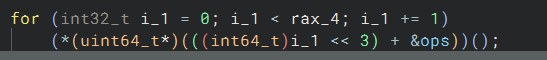
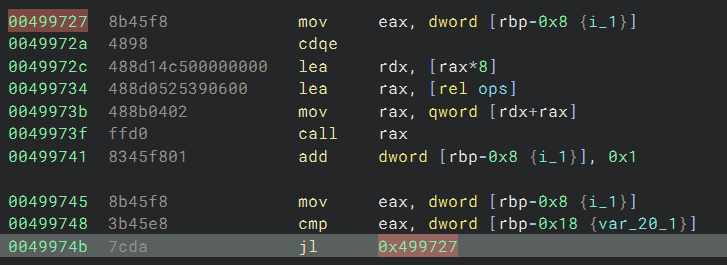

# How to add large patches to a binary

# How we can write our own patch into any binary anywhere

basically this is a solve to a challenge that i created, the brief for the challenge is that the binary has a function table and it calls 10k functions which each perform some operation on a buffer

we can control how many functions get executed by providing the number as the argument ./chall 10000 meaning all the function will execute

I wanted to solve this by patching to leak the info so basically to patch this as we don't have a buffer (or a code cave as they call it)  in the main function to write our code into we have to create an executable section where we can write our code into that prints the buffer each time 1 function is called

the loop is pretty simple



but as you can see there is no space to write our own code to as we can see here



so basically we can patch the `call rax` to just call our own function in the new segment and we can place the call rax inside of our function so there is no harm to the normal execution of the program
so our function is just a continuation of that function and our function just does

```nasm
       call    rax
       lea     rdi, [rel buf]
       call    puts
       add     dword [rbp-0x8], 0x1
       retn     {__return_addr}
```

which just prints the buffer that we are interested in

and in the end if we execute ./chall_patched 10000 we can see each time the call is made the buf being printed we can add even further logging to it like also printing the loop counter

and also there is no need to write in assembly either we can also just write the function we want to add in c, compile it and then steal the asm from that function just make sure the code we are stealing from the callee (the stub we are replacing our own func call with) stays consistent with execution into the caller
like here we have to add the weird call rax which obv a normal function wouldn't start with

Lots of naunces to it tho that i have yet to discover if you know more about the topic do let me know!

thanks for reading

Here is the solve script

```python
import lief
from pwn import *
import os

BINARY_PATH = "./chall" 
OUTPUT_NAME = "./chall_patched"

DATA_ADDR = 0x00111900
PUTS_ADDR = 0x003d040

binary = lief.parse(BINARY_PATH)
section = lief.ELF.Section(".lol")
section.content = [0x90] * 0x300 
section.flags = 0x7 
section = binary.add(section) 
binary.write(OUTPUT_NAME)

NEW_SECT_ADDR = section.virtual_address

context.arch = 'amd64'
e = ELF(OUTPUT_NAME)
e.address = 0 

unique_sig = b'\x48\x8b\x04\x02\xff\xd0\x83\x45\xf8\x01'
matches = list(e.search(unique_sig))

HOOK_OFFSET = matches[0] + 4

part1 = asm("""
    call rax
""")

current_addr = NEW_SECT_ADDR + len(part1)
lea_offset = DATA_ADDR - (current_addr + 7)
lea_instr = b'\x48\x8d\x3d' + p32(lea_offset, signed=True)

current_addr += 7
call_offset = PUTS_ADDR - (current_addr + 5)
call_instr = b'\xe8' + p32(call_offset, signed=True)

part2 = asm("""
    add dword ptr [rbp-0x8], 1
    ret
""")

full_payload = part1 + lea_instr + call_instr + part2
e.write(NEW_SECT_ADDR, full_payload)

trampoline_offset = NEW_SECT_ADDR - HOOK_OFFSET - 5
trampoline_bytes = b'\xe8' + p32(trampoline_offset, signed=True) + b'\x90'
e.write(HOOK_OFFSET, trampoline_bytes)

e.save(OUTPUT_NAME)
os.chmod(OUTPUT_NAME, 0o755)
```
