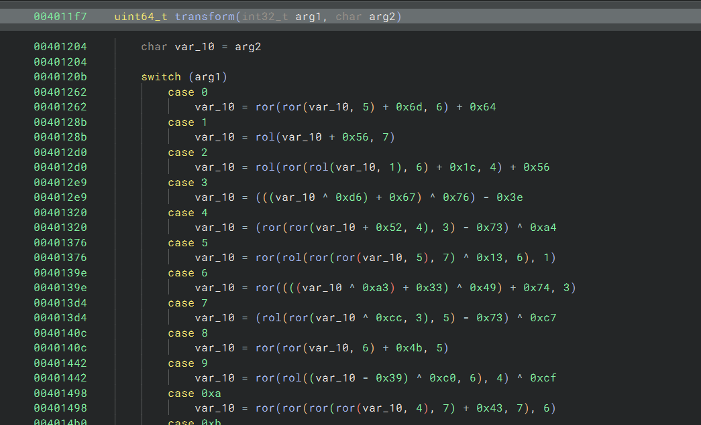

# REV Writeups

# Reverse 1

loading the binary in binja we can see



theres this transform function that applies many transforms to our input and 


in this loop the bytes are compared 1 by 1 after transforming 


these are the bytes

so just write a reverse transform script on these bytes to get our correct input so that it matches these bytes after all transforms

```python
def rol(x, r):
    return ((x << r) | (x >> (8 - r))) & 0xff

def ror(x, r):
    return ((x >> r) | (x << (8 - r))) & 0xff

def transform(i, b):
    b &= 0xff

    if i == 0:
        u = ror(b, 5)
        u = ror((u + 0x6d) & 0xff, 6)
        return (u + 100) & 0xff

    elif i == 1:
        return rol((b + 0x56) & 0xff, 7)

    elif i == 2:
        u = rol(b, 1)
        u = ror(u, 6)
        u = rol((u + 0x1c) & 0xff, 4)
        return (u + 0x56) & 0xff

    elif i == 3:
        return ((((b ^ 0xd6) + 0x67) ^ 0x76) - 0x3e) & 0xff

    elif i == 4:
        u = ror((b + 0x52) & 0xff, 4)
        u = ror(u, 3)
        return ((u + 0x8d) ^ 0xa4) & 0xff

    elif i == 5:
        u = ror(b, 5)
        u = ror(u, 7)
        u = rol(u ^ 0x13, 6)
        u = ror(u, 1)
        return u & 0xff

    elif i == 6:
        return ror((((b ^ 0xa3) + 0x33) ^ 0x49) + 0x74, 3) & 0xff

    elif i == 7:
        u = ror(b ^ 0xcc, 3)
        u = rol(u, 5)
        return ((u + 0x8d) ^ 199) & 0xff

    elif i == 8:
        u = ror(b, 6)
        u = ror((u + 0x4b) & 0xff, 5)
        return u & 0xff

    elif i == 9:
        u = rol(((b - 0x39) ^ 0xc0) & 0xff, 6)
        u = ror(u, 4)
        return (u ^ 0xcf) & 0xff

    elif i == 10:
        u = ror(b, 4)
        u = ror(u, 7)
        u = ror((u + 0x43) & 0xff, 7)
        u = ror(u, 6)
        return u & 0xff

    elif i == 11:
        return ((((b + 0xbc) ^ 0xb6) - 0xd ^ 0xe8) + 0x51) & 0xff

    elif i == 12:
        u = rol(b ^ 0x32, 5)
        return (((u + 0x1f) ^ 0x8e) + 0x6e) & 0xff

    elif i == 13:
        return rol((((b + 100) ^ 0x6f) + 0x51) & 0xff, 3)

    elif i == 14:
        u = rol(b, 1)
        u = ror((u + 0x5b) & 0xff, 3)
        return (u + 0xae) & 0xff

    elif i == 15:
        u = rol(b, 5)
        u = rol(u, 5)
        return (u + 0x29) & 0xff

    elif i == 16:
        u = ror(b, 2)
        u = ror(u, 4)
        u = rol((u + 0xb8) & 0xff, 5)
        return (u - 0xb) & 0xff

    elif i == 17:
        u = ror(b ^ 0x8b, 2)
        u = rol(u, 3)
        u = ror(u, 3)
        u = rol(u, 7)
        return u & 0xff

    elif i == 18:
        u = rol((b - 0x1f) & 0xff, 5)
        u = rol(u, 6)
        u = rol(u, 2)
        return u & 0xff

    elif i == 19:
        u = ror(b, 7)
        return ((u + 0x9f) ^ 0x2e) & 0xff

    elif i == 20:
        u = ror(((b ^ 0xd8) + 0x82) & 0xff, 7)
        u = ror(u, 4)
        return (u + 10) & 0xff

    elif i == 21:
        u = ror(b, 5)
        u = rol(u, 2)
        u = rol(u, 1)
        return ((u + 0x4e) ^ 0x7e) & 0xff

    elif i == 22:
        u = ror((b + 0x5c) & 0xff, 3)
        return (((u + 0x6b) ^ 0xaf) + 0x82) & 0xff

    elif i == 23:
        u = ror(b, 6)
        u = ror(u ^ 0xa5, 4)
        return (u + 0x21) & 0xff

    elif i == 24:
        u = rol(b, 1)
        u = ror(u, 4)
        u = rol(u, 6)
        return ((u ^ 0x2d) + 0x2a) & 0xff

    elif i == 25:
        u = rol(((b + 0x67) ^ 0xb6) & 0xff, 4)
        u = rol(u, 6)
        return u & 0xff

    elif i == 26:
        u = rol((b + 0x38) & 0xff, 3)
        return ((u ^ 0xc9) + 0x15) & 0xff

    elif i == 27:
        return (((b ^ 0xe9) + 0xa3) ^ 0x29) & 0xff

    elif i == 28:
        u = ror(b, 6)
        u = rol(u, 5)
        u = ror(u, 2)
        return ((u ^ 0x6f) + 0xaf) & 0xff

    elif i == 29:
        u = rol(b, 3)
        u = ror(u, 4)
        u = rol(u, 6)
        return ((u + 0x13) ^ 0x12) & 0xff

    elif i == 30:
        u = rol((b - 0x38) & 0xff, 1)
        return ((u ^ 0xf0) + 0x10) & 0xff

    elif i == 31:
        u = ror(b, 5)
        u = rol(u ^ 0xd9, 3)
        u = ror(u, 5)
        return (u - 0x28) & 0xff

    elif i == 32:
        u = rol(b ^ 0xd9, 3)
        u = rol(u, 3)
        return ((u ^ 0xc5) - 4) & 0xff

    elif i == 33:
        u = ror(b, 1)
        u = rol(((u ^ 0x11) + 0x32) & 0xff, 5)
        return u & 0xff

target = [
    0x63,0xcb,0xbc,0x61,0x2f,0xe4,0xfa,0x70,
    0xc1,0x2f,0x8e,0xb5,0xb0,0x40,0x65,0xde,
    0x85,0x9a,0xaa,0xd1,0x2b,0x16,0x35,0x68,
    0x01,0xb5,0xe1,0x54,0x33,0x70,0x11,0x82,
    0xe6,0x3c
]

flag = bytearray()

for i in range(34):
    for b in range(256):
        if transform(i, b) == target[i]:
            flag.append(b)
            break

print(flag)
print(flag.decode(errors="replace"))

```

# Reverse 2


here the program builds the loading laser ui thing you could try to patch the sleep and bruteforce it but it would be way too slow


this branch here checks if the buffer at data_4d2900 is printable or not so we can assume that buffer holds our flag.

there are multiple approaches to this but the easiest would be just to bruteforce in the increments of 100s to see where the part of flag comes up

but more approaches are to either patch the program to print the buffer and execute with args as 9999 then the program will just print the flag at some point

> [!NOTE]
> checkout this approach here: [How to add large patches to a binary](/posts/how-to-add-large-patches-to-a-binary)

or add a hardware watchpoint with condition for the flag format (RAIT-CTF{) and then just go a few 1000 instructions forward to get to the flag 

# Reverse 3

this one is pretty easy 

first you had to identify the type of exe we are working with using any tool like Detect it easy or any other method to find out the exe is a python executable

names for file may vary as im using the build version

then we can extract the python bytecode using https://github.com/extremecoders-re/pyinstxtractor

after extracting it we get these files


the spaceinvaders.pyc is the main code we are interested in we can use [https://pylingual.io/](https://pylingual.io/) to decode the pyc file to python readable code

and then view the game source there is a condition where if the player reaches 1337 points and enters a specific sequence of characters which is ↑ ↑ ↓ ↓ ← ← ← ← U A a hidden qr code screen would popup for the player


but no one has seemed to done that (from what i read atleast) and rather used AI and AI was able to guess that the RLE encoded data was a qr code :(( 
AI is getting too good

# Reverse 4

you were given a rust binary in this one which runs a cli program that is seemingly pretty useless but has a hidden flag condition 

basically the program uses a hash function to decode timings and the timings are responsible for the trigger of the flag condition

if we send any inputs to the cli that do not block our input and only respond with something so that there is no delay between i/o

we can reverse the hash func to find the timings and send them here is my solve script 

```c
from pwn import *
import time

context.log_level = "info"

BIN = "./main"

# ── Reimplemented hash from binary ──
def h(n):
    v = n ^ 0xA3
    v = (v * 0x1F) & 0xFFFFFFFFFFFFFFFF
    v ^= (v >> 3)
    v = (v + 0x91) & 0xFFFFFFFFFFFFFFFF
    return v & 0x7FF

targets =[ 638, 413, 413, 568]

delays = []
for t in targets:
    for n in range(1, 11):
        if h(n) == t:
            delays.append(n)
            break
    else:
        raise Exception(f"no delay found for {t}")

log.success(f"derived delays: {delays}")

p = process(BIN)

def touch():
    p.sendline(b"3")   # safe, non-blocking, feeds gate

touch()

for d in delays:
    log.info(f"sleeping {d}s")
    time.sleep(d)
    touch()

p.interactive()

```

this is for the local solve, to get the flag the process has to be swapped with the host and port for the server provided in the chall

the main difficult part of this challenge was that it was written in rust which is harder to rev than most other languages

# Reverse 5

this went unsolved and was actually a pretty hard challenge for the breif of the challenge basically

the challenge is divided into 2 parts, the parent binary runs 2 child processes, and those 2 child processes each ask input from us which are part of the flag

the parent binary uses these keys and iv with AES ECB to decode the elf files in .data section of the binary

file1 key and iv = 66677788899911111234098748383838 00112233445566778899aabbccddeeff
file2 key and iv = 1234509876ababcdecde0f0f09091123 00112233445566778899aabbccddeeff

the main hard part of the challenge is figuring this out that how the elf files are being decoded because the AES algo is hardcoded in the binary itself and is not actually imported from a crypto library

but we can bypass that with dynamic analysis since there are no anti-debug methods present in the binary

one the program starts and the child process is executed we can break out by pressing ctrl+c in gdb and do this to dump the child process

```c
 shell cp /proc/3929/exe dumped_child.bin
```

3929 was the pid given to the child process you can see what the pid is and do it yourself

now that we have this binary we can reverse it to find that its has implemented a chacha20 cipher which any AI even is able to figure out how if you give it the direct functions and it can tell you where the data and everything is 


that is the chacha20 function the 2 params its taking in as data are the key and the iv

chacha20 key - a1a2a3a4a5a6a7a8a9b1b2b3b4b5b6b7b8b9c1c2c3c4c5c6c7c8c9d1d2d3d4d5
chacha20 iv/nonce -deadc0debeefdeadbeefeded

it encodes our input var_a8 with chacha20 and compares it with the hardcoded ciphertext

we can see our flag bytes are at data_4a40d0

so using any online chacha20 decoder we can get the first part of the flag


we get the first part correct we can repeat the process for dumping the 2nd binary in gdb 

now since gdb was throwing many errors to me i just ended up nopping out all the instructions reponsible for the 1st binary and we can just proceed with execution of the second binary and then repeat the process 


converted the first part to all nops ^

now doing the same process for getting this child process then dumping the elf in gdb

we get our 2nd binary

in this its very clear just by looking that its a custom base64 charset and the program just encodes our input with custom base64 and checks if the input is equal to a specific b64 encoded string


we can see thats what its comparing against altho binja seems to have guessed length incorrectly for the string we can fix that

and above there is our custom b64 charset again using online tools to decode we can easily do this

QpaZIivj4ndG=H021y+NO5RST/xPgUz67FMhYq8b3wemKfkJLBocCDrs9VtWXlEuA is our charset

y5w6USQs=RBKSr9LUcXu2L is our ciphertext


and there we have both the parts entering them into the binary we have


making the flag

RAIT-CTF{p4r71_f33l5_ez_eNUFFEZ_up71ll_n0w???}

to conclude the challenge was decent if you knew how to do dynamic analysis on such a program