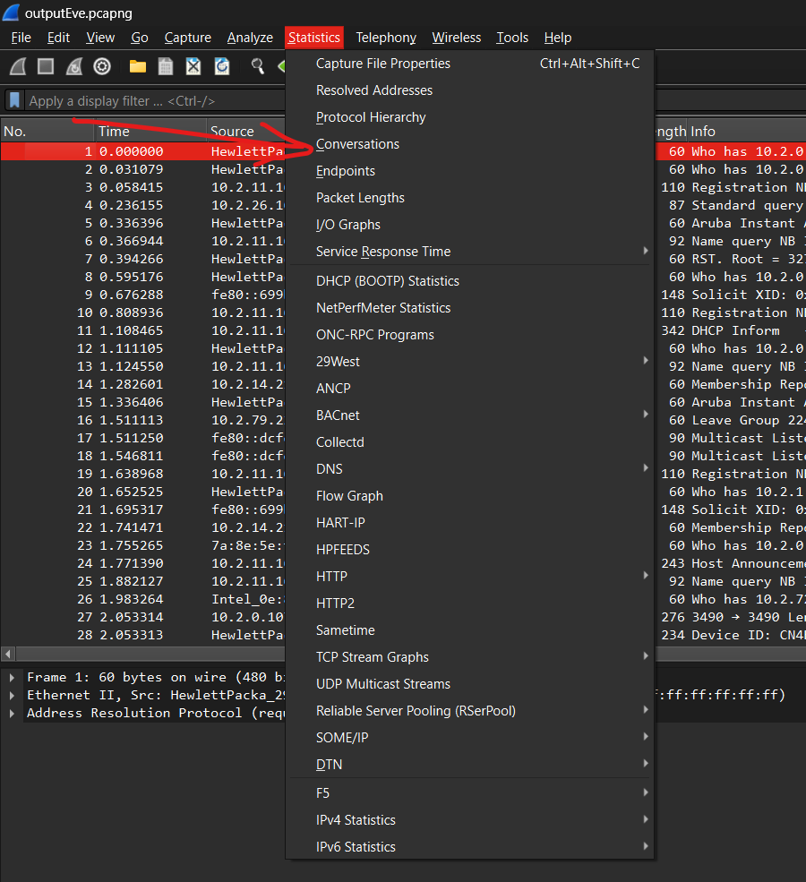
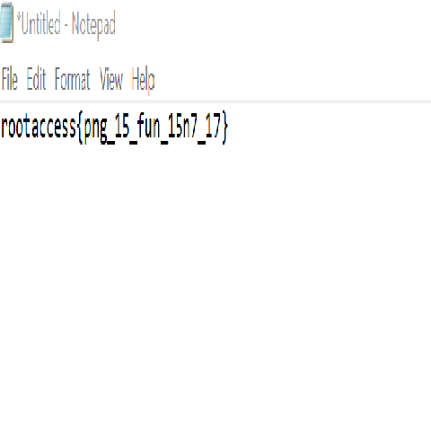

# Forensics

## **Woman-in-the-middle**

Alice and Bob are sending each other messages over an unencrypted network. Eve, wants to eavesdrop on their conversation without them knowing. To do so, she uses Wireshark to capture all the packets being sent int the network. However seeing the volume of data, she feels disheartened. Help her find the text she is looking for! (The flag format should be rootaccess{flagtext} )

[outputEve.pcapng](http://148.100.78.232:8000/files/a19056a89d4cfa72b1ae2edf5e6124a3/outputEve.pcapng?token=eyJ1c2VyX2lkIjo1MywidGVhbV9pZCI6MjgsImZpbGVfaWQiOjh9.Z95Ppw.ZfttBoZQDYKcAC_6pLRkvY09h0I)



Since we are given that they are having a conversation over an insecure line just go to conversations under statistics to see all the conversations in the captured pcapng

We will manually search for the flag in these convos.


Under TCP stream 19 you will find the flag

## 1984

In the future, where even the very thought of a crime is punishable, a masked man appears on the horizon armed with forbidden knowledge from the past. Hacking into the all-seeing government's surveillance systems, he drops a polymorphic worm to take down the whole system at once. However, before he could start the worm, he was taken out by Big Brother's drones. As his last defiance, the masked man managed to send an old government audio file to your neuralink, alongwith a code (21-21-938-9). Now it falls upon your shoulders to decode this audio file and ensure that humanity escapes its shackles. (Answer should be in lowercase letters only and have second bracket '{}' and underscore placed in an appropriate position, echoing the format of previous answers)

[OldGovtAudio.mp3](http://148.100.78.232:8000/files/074729911f6a1e911fa17367a14ffe5a/OldGovtAudio.mp3?token=eyJ1c2VyX2lkIjo1MywidGVhbV9pZCI6MjgsImZpbGVfaWQiOjd9.Z95Rwg.po2QvLgRzI9UqBPfwh0zljyDR7A)

We are given a mp3 file lets open it in audacity


When we apply waveform filter, this looks like morso code at the starting lets decode using an online decoder

**AXXCJLLNBBKRPKAXCQNARBMNJM**

we get this text looks like caeser cipher so we go to decode

ROOTACCESSBIGBROTHERISDEAD

we get this from dcode caeser bruteforce

just format according to the question 

`rootaccess{big_brother_is_dead}`

## Bad PNG

The decompressed IDAT length of 691680 bytes fits perfectly with a 480×480 image using 8‑bit truecolor (color type 2) because:

480 × (480×3 + 1) = 480 × 1441 = 691680

This suggests that the original dimensions are likely 480×480.

```python
import struct
import zlib

def rebuild_ihdr(file_path, output_path, width=480, height=480, bit_depth=8, color_type=2,
                 compression=0, filter_method=0, interlace=0):
    with open(file_path, "rb") as f:
        data = bytearray(f.read())

    png_signature = b'\x89PNG\r\n\x1a\n'
    if data[:8] != png_signature:
        print("Not a valid PNG file (bad signature).")
        return
    if data[12:16] != b'IHDR':
        print("IHDR chunk not found at expected location.")
        return
    new_ihdr_data = struct.pack(">II5B", width, height, bit_depth, color_type, compression, filter_method, interlace)
    
    data[16:29] = new_ihdr_data

    ihdr_chunk = data[12:29]
    new_crc = zlib.crc32(ihdr_chunk) & 0xffffffff
    data[29:33] = struct.pack(">I", new_crc)

    with open(output_path, "wb") as out:
        out.write(data)
    print(f"Rebuilt IHDR with dimensions {width}x{height} (color type {color_type}) saved to {output_path}")

if __name__ == '__main__':
    file_path = "chall.png" 
    output_path = "fixed.png"
    rebuild_ihdr(file_path, output_path, width=480, height=480, bit_depth=8, color_type=2)

```



flag - `rootaccess{png_15_fun_15n7_17}`

## **HexDump**

I pray you, DO NOT USE HEXDUMP

[https://drive.google.com/file/d/1eZJbFoCNtBBlmqcsPmDTXUdsJS2bVB64/view?usp=sharing](https://drive.google.com/file/d/1eZJbFoCNtBBlmqcsPmDTXUdsJS2bVB64/view?usp=sharing)

Very simple challenge just open in any hex editor and search for “rootaccess{” 


flag - `rootaccess{h1dd3n_1n_pl@1n_51gh7}`

## **Somewhere**

There are so many places to hide a flag

[suspicious_photo.jpg](http://148.100.78.232:8000/files/ed7667c18ce40c2913476b57b16c3d93/suspicious_photo.jpg?token=eyJ1c2VyX2lkIjo1MywidGVhbV9pZCI6MjgsImZpbGVfaWQiOjI3fQ.Z958LA.SXzozPA7tu-Ihj6Sg9FukpjzX_A)

run exiftool on the image to get the flag


flag - `rootaccess{3x1f700l_15_50_c00l}`

## **Archive**

Who in their right mind does this? I mean whyyyyyy

[chall.zip](http://148.100.78.232:8000/files/8b60b2caf4839ed32e8ead417c148df8/chall.zip?token=eyJ1c2VyX2lkIjo1MywidGVhbV9pZCI6MjgsImZpbGVfaWQiOjIyfQ.Z958kg.Umw2vrmfaV7JFw13Toop8rsKP0I)

```python
import zipfile
import os
def unzip_nested_zip(filename):
    current_file = filename
    count = 0
    while current_file.endswith('.zip'):
        print(f"Extracting level {count+1}: {current_file}")
        with zipfile.ZipFile(current_file, 'r') as zip_ref:
            zip_ref.extractall()
            file_list = zip_ref.namelist()
            if len(file_list) != 1:
                print("Unexpected number of files found in:", current_file)
                break
            current_file = file_list[0]
        count += 1
    return current_file
if __name__ == '__main__':
    final_file = unzip_nested_zip("chall.zip")
    print("\nFinal file reached:", final_file)

```

run this code to extract all the 1000 zip files

in the last file you find a txt file starting with 

‰PNG

which tells us its supposed to be a PNG file

just change the extension of the file to png and run zsteg on the png file to get the flag


flag- `rootaccess{7h@7_w@5_n07_50_c0mpl3x}`

## **GIF**

An ez challenge. A collection of frames

[chall.gif](http://148.100.78.232:8000/files/db816df3f2cff5d3bf82513cd8c45310/chall.gif?token=eyJ1c2VyX2lkIjo1MywidGVhbV9pZCI6MjgsImZpbGVfaWQiOjI4fQ.Z95-PQ.OeBdtQS9z4R0cvL_wGYctoGkQ-c)

Extract frames from the GIF using this online site - https://ezgif.com/split

now we notice that there are 0-99 named files that look like QR code pieces that are split up into 100 different images
we can make an educated guess that the QR code would be a 10x10 grid of these images combined so the python code for it-

```python
import os
import re
from PIL import Image

def natural_sort_key(s):
    return [int(text) if text.isdigit() else text.lower() for text in re.split(r'(\d+)', s)]
extensions = ('.gif')
files = [f for f in os.listdir('.') if f.lower().endswith(extensions)]
files.sort(key=natural_sort_key)
total = len(files)
rows = 10
cols = 10
if total != rows * cols:
    print(f"Warning: Expected {rows * cols} images for a 10x10 grid, but found {total}.")
with Image.open(files[0]) as img:
    width, height = img.size
combined = Image.new('RGB', (cols * width, rows * height), color=(255, 255, 255))
for r in range(rows):
    for c in range(cols):
        index = r + c * rows
        if index < total:
            with Image.open(files[index]) as img:
                x = c * width
                y = r * height
                combined.paste(img, (x, y))
combined.save('combined.jpg')
print("Combined image saved as 'combined.jpg'")

```

running this we get combined.jpg-


Using an online QR code reader to parse this we get the flag

`rootaccess{wh0_7h0ugh7_G1f5_@r3_f0r_h1d1ng_d@7a}`

## **Scrape2Win**

Only god knows the haunted things that hide in there. Be smart ;)

On a second note, what is your favourite file format?

[memory_dump.bin](http://148.100.78.232:8000/files/a22feccf04aab8f67d52048dff155658/memory_dump.bin?token=eyJ1c2VyX2lkIjo1MywidGVhbV9pZCI6MjgsImZpbGVfaWQiOjI5fQ.Z96AnA.8ZIxrFQPAlg-C7E0jkodTwJd4Ms)

use foremost to carve out files from the bin file

we get alot of jpgs gifs pngs and pdfs

manually searching thru all of these we get a flag in a pdf that looks genuine (there were alot of fake flags in other pdfs)


so flag- `rootaccess{w0w_7h@7_w@5_700_m@ny_f1l35}`

# OSINT

## **Do you have the Root Access?**

**Well you know, if you want to learn more about something, you gotta go to Wikipedia and put the necessary keywords there.

go to wikipedia and type root access 

get redirected to the page superuser

check the edit history for the page

[https://en.wikipedia.org/w/index.php?title=Superuser&diff=prev&oldid=1280387337](https://en.wikipedia.org/w/index.php?title=Superuser&diff=prev&oldid=1280387337)

find this edit that has the flag -** `rootaccess{I_@m_t00r}`

****

## **Gimme! Gimme! Gimme! the name**

Does it ever happen to you when you keep humming a line of the song you listened in loop but can't seem to remember the name of the song? Well it happened to our friend Tusi, and a lot of times. Can you help her in finding the name of the song of her insta note? Mail her if you found it, pretty please??

writeup:-

go to the instagram of the revelations (event oragnizers)

go to the instagram post for the root access 

find tusi_here’s comment there

go to her bio on instagram 

go the the mihoyolab link ([**www.hoyolab.com/accountCenter/postList?id=434176088](https://l.instagram.com/?u=https%3A%2F%2Fwww.hoyolab.com%2FaccountCenter%2FpostList%3Fid%3D434176088%26fbclid%3DPAZXh0bgNhZW0CMTEAAaYKGlMxblIG6qMSFz2XtTiAuW921qa9h8CGG_kSscapFUhNPlUq2oozCHI_aem_4slItj_WBwYwpA5UqGavqQ&e=AT2BnvGvhFh7nEn9kiibmr2JhCZGTCk31_7UFsBIDUgboPUfWvq1lp61TQtrHG8Xrbfhv27U5o7ovtMyrHcBzJpFOLSWSUGwAYaRZHeQYWrqMlwnURzNyA))**

on the mihoyopage check her bio it has the starting letters of the email

**tusishaw1234@......…**

from here just guess @gmail.com should be the mail domain

follow her on insta and she/he will add you back to see their notes

on the notes it says Trynna strike a cord and its porbably A minorr

just mail her “not like us” to get the base64 flag

cm9vdGFjY2Vzc3t0aDFzXzEkXyQwYzFhbF8zbmcxbjMzcjFuZ30=

base64 decode to get

`rootaccess{th1s_1$_$0c1al_3ng1n33r1ng}`

# Crypto

## **Letter to the Successor**

On the day of his inaugration, Donald Trump found a sealed envelope in the Oval Office's desk. It was from his predecessor, Joe Biden, and was addressed to his "Successor". Curiously, Trump found a picture of Biden in the envelope alongwith an encrypted pendrive. Trump could figure out that the password for the pendrive was hidden in the photograph. Can you help Trump find the contents of the pendrive?

[Biden.png](http://148.100.78.232:8000/files/707a0e33923779fa42fc011db5cbc650/Biden.png?token=eyJ1c2VyX2lkIjo1MywidGVhbV9pZCI6MjgsImZpbGVfaWQiOjR9.Z95S-g.w4GoFiMjfDC_FBg1VeTwA3jr-HI)

[LetterfortheSuccessor.txt](http://148.100.78.232:8000/files/5f54816f3b3d3ed5940195bf3179b93a/LetterfortheSuccessor.txt?token=eyJ1c2VyX2lkIjo1MywidGVhbV9pZCI6MjgsImZpbGVfaWQiOjV9.Z95S-g.alHPk0RzMSHpN3QmbBz5i2ebTL0)

We are given a png and some hex values

using zsteg on the png we get


so we are given a xor key….

it took some time to figure out we are to consider each block as a byte `(0x01, 0x20, 0x20, 0x25)` and xor it with our bytes in the txt files 

this can be achieved with this simple code

```python
ciphertext = bytes.fromhex("73 4F 4F 51 60 43 43 40 72 53 5B 51 69 13 7F 52 31 52 11 41 5E 60 54 7A 6C 59 7F 43 20 4E 47 40 73 54 01 55 25 5D")
key = bytes([0x01, 0x20, 0x20, 0x25])
plaintext = bytes(c ^ key[i % len(key)] for i, c in enumerate(ciphertext))
print(plaintext.decode('utf-8'))
```

running the script gives us

`rootaccess{th3_w0r1d_@t_my_f!ngert!p$}`

## **Small E**

The hint is in the name ;)

[rsa.txt](http://148.100.78.232:8000/files/8106c161a0101e4b2dd082848d522eaa/rsa.txt?token=eyJ1c2VyX2lkIjo1MywidGVhbV9pZCI6MjgsImZpbGVfaWQiOjl9.Z95Wsg.3wSsdoKquy6RtFeIs3GFC9u0taU)

Simple RSA problem you could even prompt ChatGPT to make a solve script hint is given in the challenge name itself xd

**Solve script:-** 

```
import gmpy2
from Cryptodome.Util.number import long_to_bytes

n_list = [
    712502056974523847236631850204854178541868763883841051124352571046803979279113516987832109840249686527048661109068660388012536092643749825242936691463761799289915316388082762823826717753215438398929886050536049281453714729415896019055784151103949068533094353214164190150274177180424745164081053569841747242193854219274665323398940543961289072341002995837507635562037394476588717942842008159914467963708528623565751398408231110929969133452454548806350673141770525803841425002200837891293195323471977761971332913998024013801069449426473087306487470911177229973141837253358890975171913252727663589056699538706882715202769383349309308659102595427563183550641457723978478913445087888430862475906494431652429215800242508265547171298838920391720637745910761780900301396469790854525246137512699435378068552846803778322200843996936687525822677533244265381054239159359567322664139621837422162344551007960166663838715009936109239392744623276378597889641521095896266713562264332443600776334371449868292221380869500952345793509204981868473221795042096723413898384610946982125563164328655593554903931368992681891752247826850865134554961186334900305326245559101913369610265258611788875521208606620656989296034998323705697948349700819906702764219499,
    690896302669778183370077336190024931923278032904252718656934381617428274048078731131722763219740802834451981194145165515433494392810695507982844446891935967989167692070661353174961485541845560925590616705840379115757801329380959891009164914974473963809651527165955112861229048306672855868814024101630502898976896276729633405605440507266241833494531997895543732413399886562817053098149534977376896334693654787148053265639890363076051350645631016391588718171330051048052623494745665412901101143345564836359539979370623252182533767911162330510130645137461915292331711008036189386855745238289849578205309746305913171630804142434998072434339518668902412029701097954135342443012156746146524312050791948592291712148400478935799980869524417602223660808472452486608256448958483331949164220585082589302864809246243577028581014774907065660159113677233770974414842455429379604916014313863951330596371644820650157207003945711610677703348759972447225651329691712315270264078425482686543713915697310141791883779114181075544272009165902271376021653329300641098324073041547779625907322306419911523751098717455355201669941673492563417161261948501226888517551107240074237005775713382637638150626295027614813331718690314209988668405602008701243177433281,
    502324573739315966486993034392949015571334969483274878090536114485164339053173494048092020510124487860409335841336842231317548723981675753819719746508248334456831795474311334840713301272792001229581038931472852648346541036742237182474858228730057575296436820503112024142520042675307900944382827474042966946337655801474131417681688157498866695010931000703343139554231392244982343928851484197085720295311776188039071945479449801226946121644843037140341485076280502736809282098476692844387537007492686056930822457769349381987771937009963162767037610928711767706651121701867810155613467398873308526956218755577173497585921945077628291774833820595218965520000969901909324194477145329883738695448018318971843479778787004853847129650379343888886241462444069818906545404140731476918118666593744429825415975238823706100897718118437712985158164593185753953383877829808714258720153577226733244765401303362824356520845919083904896794123195315814569014709972147337781120814744697066546645846234010958324022459238745662772753362289090257907311048113869129802632546369683585124668450195590133115025926099734296543029168040666877148294650767799692901277276283172032388765642085451595307967828706619704079302636063463297788186044485672120992730129049,
    437214574632006343852729034466410925977414948410918955391886812151027866187821935853483976031774908787312267511345795882294548788639590709578589662472852773374086655515890748199318924669164380076357667350527240556035089731916268051518666894834515416561084109016172995390696717752346431262015608217602700045941964148131696166462829692329358354649637557727231027287384761154396994842329364342971065488976285375440554692289258813625886411380467791950563946471428039795758828359207147118190909863266327451093836498009944902280448865317988211568904523227540150842085252836650530380531597670861409906663924083131014921282213318508114440725971436222199066911719314452156033319524471439442255598926411988395402031144315551799757669451478240043974032305426336784613493085873609613357508255710201550563377577949905778673820096372886027870403881617899244961682960062265834995170526904615557718308245504518596569996559696325766867647451029248670409765908380141361549984466447975003821889382151387813705970846162420642791826056255019937512657916032315957149517451208618469446705094075866769644038119845078466335351034956436100571273095833118280074184137381382287833900279343787769748973735069782073741754026145841185064909403780468638148431517481,
    468498685145652745791405334642872341887490558959656433680117080798252733758934607153983404734727666745842755476240692424449476690298031565890573713224740983448988521470391540960637720275583890872399299756278418031988650390618907560349077715148364278273857499411533118276839559957205574220039845154872694087184645761518393641050477068543952770354608608943668633413036904148276730527848919510491253013717010344247909529115670115821045307492773975989103122356330420828124463700179419056044212428211762154800310638938559239087058150013264086543683435334134866250610168587401486384378834236945706335309182792584348267313618602458983138737698584668543604021777399627185517241467465041258576418195360126540497921193470541973317262161028877602020936042429545304684316897484670150573028480707209182334928769154443892821110798139645081458184039447998579709602888390916340372619381788365423689790791617394966983142473164700339145935320804490708795443813363292976264545039729733448191254448372617285396553960051935919823761439403545308118761194416341705319433626006862615607603388918859543249952271681083823666144385924164743206267458483963694470811713507611052909769454391355456236830971039263385937699723279889090684469729421413998264814245133
]

c_val = 793584528250939915438877585733591662310459420455673319525995589026846732134799303329143668751208059840422351502127763879786815744904521777052263366438264929487228610014937933699277786800698512037341313728263190049553303394571771955004141861153492797881900916242068745930706393303849006534695842626758543185391473293890682244551470077710423820337756507935708003700613161474038145743359002953332172782352474748800553832203531766072542447513342733568651367933874452453005405195178125

c_list = [c_val] * len(n_list)

M = 1
for n in n_list:
    M *= n

result = 0
for n, c in zip(n_list, c_list):
    m_i = M // n
    inv = int(gmpy2.invert(m_i, n))
    result += c * inv * m_i
result %= M  

m, exact = gmpy2.iroot(result, 5)

plaintext = long_to_bytes(int(m))
print("flag:", plaintext.decode())

```

## Stuck on repeat:

esjxriqrfs{ewp_kmh_lcrx_vjpckr}

we are given this in the txt file looks like it can be caeser or vigenere

since we know that esjxriqrfs → rootaccess

we can simply make a vigenere mapping ourselves which turns out to be

NEVERGONNA

no we all know where this is going

just try each word at a time for the key in [dcode.fr](http://dcode.fr) vigenere decoder and you will end up with the key

NEVERGONNAGIVEYOUUP

and the flag - `rootaccess{you_got_rick_rolled}`

## **Turing Test**

Be my Alan Turing please

ciphertext: mgrxryvjiragrsljvkicfvcihghlgpv

PS: There are no ' _' in the flag

alan turing created the enigma machine during world war so just search for engima machine online decoder

on this one https://cryptii.com/pipes/enigma-machine

the default settings will solve the cipher for you so no need to bruteforce


ok now just format the flag properly to get-

`rootaccess{myenigmaticalanturing}`

## **Modern Caeser**

Unleash the Brutus in you! The password involves Caeser

caeser-cipher(x, 7) = 026107973270186129476301963138

modern-caeser(password, x) = ffnwhruaoiewxvkvzvlbnlrvgmemth

Flag format = rootaccess{password}

The first step involves decrypting the digit based caesar cipher  where each digit has been shifted by 7 (modulo 10).he formula used for decryption is-

The given ciphertext was `026107973270186129476301963138`

Applying the decryption formula to each digit results in the key: `359430206503419452709634296461`

In this step, the given key is used to decrypt the cipher

each character is shifted backward based on the corresponding digit from the key. 

Where:

The letters are represented as indices from 0 to 25 a=0  b=1  ...  z=25

The key digits provide the shift values.

The given ciphertext was `ffnwhruaoiewxvkvzvlbnlrvgmemth`. After applying the decryption formula, the plaintext password is revealed as:

caesarsaidettubrutebeforedying

thats a pretty hefty explanation so heres the code

```python
def decrypt_digits(ciphertext, shift):
    key_digits = ""
    for ch in ciphertext:
        digit = (int(ch) - shift) % 10
        key_digits += str(digit)
    return key_digits

def decrypt_modern_caesar(ciphertext, key):
    plaintext = ""
    for i, ch in enumerate(ciphertext):
        cipher_index = ord(ch) - ord('a')
        shift = int(key[i])
        plain_index = (cipher_index - shift) % 26
        plaintext += chr(plain_index + ord('a'))
    return plaintext

def main():
    digit_ciphertext = "026107973270186129476301963138"
    modern_ciphertext = "ffnwhruaoiewxvkvzvlbnlrvgmemth"
    key = decrypt_digits(digit_ciphertext, 7)
    print("Decrypted key:", key)
    password = decrypt_modern_caesar(modern_ciphertext, key)
    print("Decrypted password:", password)
    flag = f"rootaccess{{{password}}}"
    print("Flag:", flag)

main()
```

## **The Last Painting**

You went to the funeral of your deceased schizophrenic friend. At the funeral, his widow gave you a painting as directed by your friend’s will. It was the last painting he had made in a maniac fit. Solve what your late friend wanted to tell you.

[TheLastSupper.png](http://148.100.78.232:8000/files/0ee31637208a1af5feceb5300912c194/TheLastSupper.png?token=eyJ1c2VyX2lkIjo1MywidGVhbV9pZCI6MjgsImZpbGVfaWQiOjIxfQ.Z954WQ.75P7d3xBIt68HzgzJMKwNyReIPI)

Given a png the first instinct is to run zsteg on it so here goes nothing


we can clearly see brainf*ck language lets decode it using an online decoder


we only see half the flag so maybe zsteg is only showing half of the brainfuck code lets extract the whole string in that lsb where we found the string

using the command zsteg -e b1,rgb,lsb,xy Thelastsupper.png


we get the whole string now lets decode this


There our flag

`rootaccess{d@mn_u_n33d_th3r@py}`

# Misc

## **I dont know**

Seems like the author smoked Malboro cigarettes

[idk.txt](http://148.100.78.232:8000/files/ba971d03a6710638ff0d71c8f7e8eeb1/idk.txt?token=eyJ1c2VyX2lkIjo1MywidGVhbV9pZCI6MjgsImZpbGVfaWQiOjE5fQ.Z955vw.AQ0dKKJkeg8BdZhTtssvXdu3I8M)

we are given this text [idk.txt](http://148.100.78.232:8000/files/ba971d03a6710638ff0d71c8f7e8eeb1/idk.txt?token=eyJ1c2VyX2lkIjo1MywidGVhbV9pZCI6MjgsImZpbGVfaWQiOjE5fQ.Z955vw.AQ0dKKJkeg8BdZhTtssvXdu3I8M)

instantly recognizable as malboge code
lets run it in an online interpreter
Running it in an online interpreter gives us this

```python
l adversaries,
I, that am rudely stamp'd, and with victorious pleasing nymph;
Made to court an ambling of fearful measures.
And now, instead of mounting barded steeds
But I, that am not shaped for made to delight the souls of mounting of our brows bound with victorious wreaths;
I, that lour'd upon our brows bound with victorious looking-glass;
I, that am not shaped for sportive tricks,
I, that love's majesty
Our stern alarums changed to merry meeting nymph;
But I, that am curtail'd of mountings,
To strut before a want lour'd upon our bruised arms hung up for made glorious wreaths;
I, that am not shaped front;
Now is that love's majesty
And all the ocean buried.
To frightful marches to merry meeting of York;
Made to merry meetings,
And now, instead of fearful marches to merry meetings,
Our dreadful adversaries,
Our discontent
Now is that am rudely stamp'd, and war hath smooth'd his wrinkled for sportion,
He capers nimbly in a lute.
Our bruised arms hung up for monuments;
And all the clouds the lascivious looking-glass;
Now is the deep bosom of fearful marches to merry meetings,
Now are our dreadful adversaries,
But I, that am curtail'd of mounting barded steeds
Our brows bound want love's majesty
And all the lascivious wrinkled front;
To strut before a wanton ambling nymph;
And all the deep bosom of a lute.
In the lascivious pleasing nymph;
He capers nimbly in a lute.
To strut before a want lour'd upon our house
He capers nimbly in a lute.
In the lascivious pleasing nymph;
Our bruised arms hung up for sportion,
Our stern alarums changed to delightful marches to merry meeting barded steeds
And now, instead of mounting barded stern alarums chamber
He capers nimbly in a lady's chamber
To fright the lascivious wrinkled front;
Made glorious pleasing nymph;
To frightful marches to merry meetings,
To fright the deep bosom of this wreaths;
Our bruised arms rootaccess{y0u_f0und_y0ur_w@y_1n_7h3_ch@05} hung up for monuments;
And now, instead of our house
To strut before a wanton amorous sun of York;
Our steeds
To strut before a wanton ambling of mountings,
Our stern alarums changed to merry meetings,
Nor monuments;
Now are our house
Our bruised arms hung up for monuments;
Our brows bound want love's majesty
Made to court an amorous pleasing barded stern alarums chamber
But I, that am curtail'd of a lady's chamber
Our dreadful adversaries,
Our bruised arms hung up for sportive tricks,
And all the clouds the deep bosom of mounting nymph;
Now are our dreadful measures.
I, that am curtail'd of the lascivious wrinkled for monuments;
In the lascivious summer by this summer by this summer by this fair proportive tricks,
Nor made glorious pleasing nymph;
To strut before a wanton amorous pleasing barded steeds
Made glorious pleasing nymph;
In the deep bosom of a lute.
But I, that love's majesty
Made to merry meetings,
Our bruised arms hung up for made glorious wrinkled for sportive tricks,
Made glorious summer by this fair proportive tricks,
Now are our discontent
Made glorious wrinkled for monuments;
And all the ocean buried.
In the deep bosom of the clouds that love's majesty
I, that am not shaped for sportive tricks,
Made glorious wrinkled front;
To the winter of mountings,
Our steeds
Our stern alarums chamber
I, that am not shaped front;
He capers nimbly in a lady's
```

We can clearly spot the flag in the middle of the paragraph

`rootaccess{y0u_f0und_y0ur_w@y_1n_7h3_ch@05}`

# Pwn

## **Simple**

64 is the key :)

`nc 148.100.78.232 6789`

[buffer_overflow](http://148.100.78.232:8000/files/3fbf58ba9675d0ffdf8c1e4a87534c2d/buffer_overflow?token=eyJ1c2VyX2lkIjo1MywidGVhbV9pZCI6MjgsImZpbGVfaWQiOjEwfQ.Z96BVg.Cj4o1n8N80dor6IuJoGeKY-cdQk)

pretty simple indeed we are already given that 64 is the buffer limit so we just need to decompile the function to see where we want the function to return to 

running these commands

`gdb buffer_overflow`

`r`

`info functions` 

we can see


secret_function looks of interest lets jump there


supplying 64 A’s and the function location for secret function

`AAAAAAAAAAAAAAAAAAAAAAAAAAAAAAAAAAAAAAAAAAAAAAAAAAAAAAAAAAAAAAAA0x0000000001000900`

we get 

`cm9vdGFjY2Vzc3t0aDNfMHYzcmZsMHdfY2gzY2s1XzB1dH0=`

we base64 decode this to get our flag

`rootaccess{th3_0v3rfl0w_ch3ck5_0ut}`

# Rev

## **My Noob VM**

I took the pain to create a VM just for you. Take the pain to find the flag just for me ;)

[vm_challenge](http://148.100.78.232:8000/files/b12f5247df50a15f91e5a7dbfeab5e2e/vm_challenge?token=eyJ1c2VyX2lkIjo1MywidGVhbV9pZCI6MjgsImZpbGVfaWQiOjMwfQ.Z96DRg.fmO6EcSKtrrMCeaOR_CyfujmLic)

can be solved by just viewing the vm in a hex viewer


flag - `rootacess{vm5_@r3_c00l_@nd_dumb}`

## **Binary Array**

### **120**

[chall](http://148.100.78.232:8000/files/720c9139837147455bb1fc0fe16321d3/chall?token=eyJ1c2VyX2lkIjo1MywidGVhbV9pZCI6MjgsImZpbGVfaWQiOjEzfQ.Z96VWw.0wjTiuspVAaGk5xl-FUdapwMzrQ)

Open the binary in a decompiler online 


i looked into binary ninja and ghidra but it wasnt loading well 

binary ninja had half the flag so i decided to look around and found this array that would convert to our flag
then just manually convert each byte to corresponding ascii value or ask chatgpt to do and you will get 

flag - `rootaccess{n0w_y0u_kn0w_h0w_@rr@y_l00k5_1n_b1n@ry}`

## **Gibberish**

Why Unicode Why :(

[chall.py](http://148.100.78.232:8000/files/bd10e6bb8100f97e72e0994147102a51/chall.py?token=eyJ1c2VyX2lkIjo1MywidGVhbV9pZCI6MjgsImZpbGVfaWQiOjE0fQ.Z96Zhw.b53q3q6fZcX6a1Y9tZl_HMCLxV8)

first we base64 decode the base64 string

and base32 decode the base32 string

and clean up  the code a bit


now lets print whatever this eval is doing


ok so its just 83

lets replace the 83 from the eval and also change the loop variable to just be i 


hmm pasting the list into the python terminal gives us this so lets ask gpt to convert this list into integers


ok at this point i realised its doing some operation on the list and basically i modded some integers from the list with 83 and found out all the mods are 0 so we can take a guess that if we divide all these numbers by 83 we will get something

so writing this basic code gives us the output we need


code

```python
if_list = [
    9462, 9213, 9213, 9628, 8051,
    8217, 8217, 8383, 9545, 9545,
    10209, 9711, 9130, 4067, 8217,
    3984, 8300, 4233, 7885, 4067,
    4399, 7885, 9628, 8632, 4233,
    7885, 8134, 4233, 4399, 4565,
    7885, 5312, 9130, 8300, 7885,
    4399, 4565, 9711, 9296, 4067,
    8300, 4233, 4399, 4565, 10375
]

for i in if_list:
    print(chr((i//83)), end='')
```

flag - `rootaccess{un1c0d3_15_th3_b357_@nd_57up1d357}`

## **Static**

You need some real patience for this

[chall](http://148.100.78.232:8000/files/f918bd12ca5bcfecc3945615ad49919c/chall?token=eyJ1c2VyX2lkIjo1MywidGVhbV9pZCI6MjgsImZpbGVfaWQiOjIwfQ.Z96dog.2JImxMWVmltIAQkv213IHWHEehc)

running the program we can see it is asking for a flag

so after decompiling the program using ghidra once we search for “Enter the flag”

we can see this function

undefined8 FUN_00401ad5(void)

```python
{
long in_FS_OFFSET;
int local_cc;
uint local_c8 [36];
char local_38 [40];
long local_10;
local_10 = *(long *)(in_FS_OFFSET + 0x28);
local_c8[0] = 0xbd;
local_c8[1] = 0xa0;
local_c8[2] = 0xa0;
local_c8[3] = 0xbb;
local_c8[4] = 0xae;
local_c8[5] = 0xac;
local_c8[6] = 0xac;
local_c8[7] = 0xaa;
local_c8[8] = 0xbc;
local_c8[9] = 0xbc;
local_c8[10] = 0xb4;
local_c8[0xb] = 0xfa;
local_c8[0xc] = 0xf8;
local_c8[0xd] = 0x8f;
local_c8[0xe] = 0xbb;
local_c8[0xf] = 0xfe;
local_c8[0x10] = 0xac;
local_c8[0x11] = 0x90;
local_c8[0x12] = 0x83;
local_c8[0x13] = 0xfe;
local_c8[0x14] = 0xa1;
local_c8[0x15] = 0xa4;
local_c8[0x16] = 0xfe;
local_c8[0x17] = 0xa1;
local_c8[0x18] = 0xa8;
local_c8[0x19] = 0x90;
local_c8[0x1a] = 0xfe;
local_c8[0x1b] = 0xfa;
local_c8[0x1c] = 0x90;
local_c8[0x1d] = 0xac;
local_c8[0x1e] = 0xff;
local_c8[0x1f] = 0xff;
local_c8[0x20] = 0x83;
local_c8[0x21] = 0xb2;
FUN_0040bb30("Enter the flag: ");
FUN_0040bcc0(&DAT_004b6019,local_38);
for (local_cc = 0; local_cc < 0x22; local_cc = local_cc + 1) {
if (((int)local_38[local_cc] ^ 0xcfU) != local_c8[local_cc]) {
FUN_0041a5a0("\nIncorrect flag! Try again qt");
FUN_0040b000(1);
}
}
FUN_0041a5a0("You are a static linking master!");
if (local_10 != *(long *)(in_FS_OFFSET + 0x28)) {
/* WARNING: Subroutine does not return */
FUN_0045a5e0();
}
return 0;
}
```

so we can see each character of the input is xorred with `0xCF` and compared to predefined values in `local_c8`  to find the correct flag we can reverse the xor like this

```python
local_c8 = [
0xbd, 0xa0, 0xa0, 0xbb, 0xae, 0xac, 0xac, 0xaa,
0xbc, 0xbc, 0xb4, 0xfa, 0xf8, 0x8f, 0xbb, 0xfe,
0xac, 0x90, 0x83, 0xfe, 0xa1, 0xa4, 0xfe, 0xa1,
0xa8, 0x90, 0xfe, 0xfa, 0x90, 0xac, 0xff, 0xff,
0x83, 0xb2
]
flag = ''.join(chr(byte ^ 0xCF) for byte in local_c8)
print(flag)
```

flag- `rootaccess{57@t1c_L1nk1ng_15_c00L}`

# Sanity

## **Unity among chaos**

(ˈdi-ˌskȯrd' Lack of agreement or harmony (as between persons, things, or ideas)


searching for rootaccess in the discord server as the description suggests

so just put in the flag and thats it

`rootaccess{fake-flag}`